# chap1

## 概念 & 功能

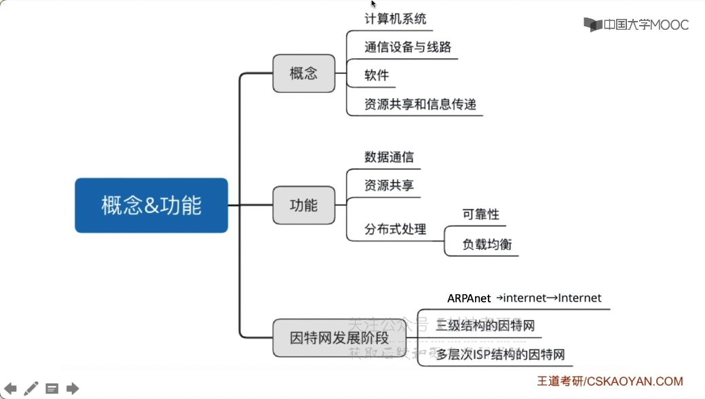

## ISP（internet server provide）

因特网服务提供者/因特网服务提供商

多层次 ISP

## 计算机网络的组成

- 工作方式
  - 边缘部分
  - Client Server 方式
  - peer to peer 方式（每个端系统，既可以是 服务器，也可以是 客户端，穿越火线）
  - 核心部分

1. 组成部分：硬件、软件、协议
2. 工作方式
   1. 边缘部分
      1. Client Server 方式
      2. peer to peer 方式
   2. 核心部分
3. 功能组成
   1. 通信子网：实现数据通信
      - 物：集线器、中继器
      - 链：交换机、网桥
      - 网：路由器
   2. 资源子网：实现资源共享/数据处理
      - 传、会、表、应

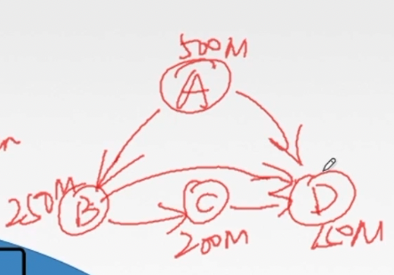

计算机网络的分类：

- 范围：
  - 广域网 WAN（交换技术）
  - 城域网 MAN
  - 局域网 LAN（广播技术）
  - 个人区域网 PAN
- 使用者分类：
  - 公用网
  - 专用网
- 交换技术方式：
  - 电路交换（在通话的过程中，一直占用资源，不能被别人中断：您拨打的电话正在通话中）
  - 报文交换：存储转发
  - 分组交换：存储转发
- 拓扑结构：
  - 星型
  - 环形
  - 网状型
  - 总线型（局域网）
- 传输技术：
  - 广播式网络：共享公共通信信道
  - 点对点网络：使用 分组存储转发 和 路由选择 机制（广域网基本上是这种）

存储转发指的是：先存储下来，然后看哪条链路比较快一些

## 标准化工作

要实现不同厂商的一个那件、软件之间的相互联通，必须遵从统一的标准

- 标准分类
  - 法定标准（OSI）权威机构指定的
  - 事实标准（TCP/IP）某些公司的产品在竞争中占据了主流

RFC（request for comments）：因特网标准的形似

RFC 要上升为因特网正是标准的四个阶段：

1. 因特网草案（internet draft）这个阶段还不是 RFC 文档（自己发邮件）
2. 建议标准（proposed standard）从这个极端开始称为 RFC 文档（草案被采纳）
3. 草案标准（draft standard） （建议标准经过社区评定）
4. 因特网标准（通过 IETF、IAB 组织）

三大组织：

国际标准化组织 ISO

国际电信联盟 ITU

电气和电子工程师协会 IEEE

internet 工程任务组 IETF

## 速率、带宽、吞吐量

吞吐量、速率、带宽

速率：单位 b/s(bit/s)、kb/s（10^3 b/s）

通信领域是：`10^3` ，而容量是 `2^10`

带宽：从某一点到领一点所能通过的 “最高数据率”

吞吐量：单位时间内通过 某个网络（或信道、接口）的数据量

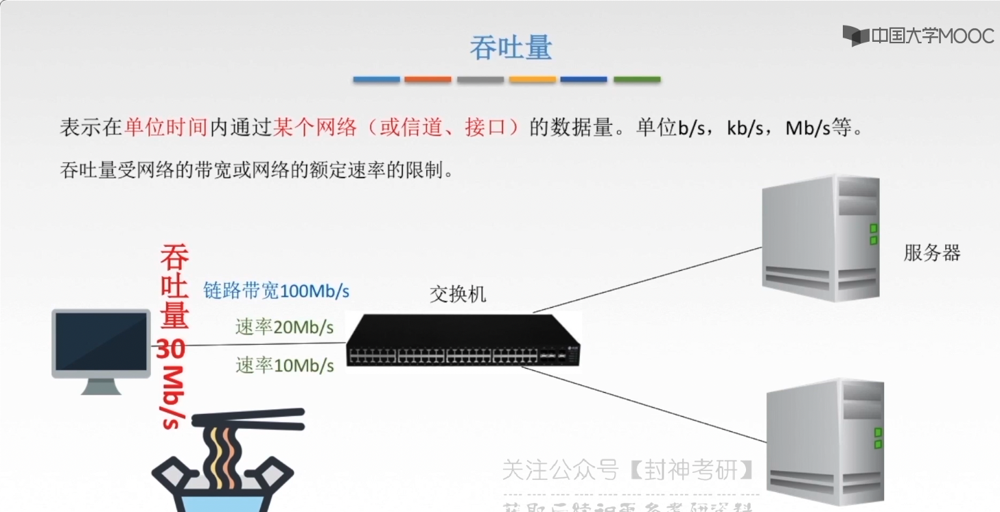

## 时延、时延带宽积、往返时间（RTT）、利用率

- 时延
  - 发送时延（发送时延 = 数据长度/信道带宽，信道带宽也就是：发送速率，当然这只是一个理想的值）
  - 传输时延（取决于电磁波传播速度，传播时延 = 信道长度/电磁波在信道上的传播速率）
  - 排队时延（路由器，机场安检，要排队的）
  - 处理时延（安检是需要时间的）
- 时延带宽积(bit) = 传播时延(信道长度/电磁波速率, bit) x 带宽(b/s)
- 往返时延 RTT：从发送方发送数据开始，到发送方接收到 接收方的确认（接收方接收到数据后立即发送确认）总共经历的时延
- 利用率：
  - 信道利用率 = 有数据通过时间/(有+无)数据通过时间
  - 网络利用率：信道利用率加权平均值

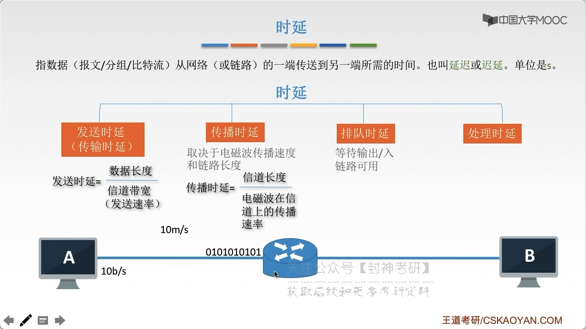

其实上面，也就只有：发送时延 取决于 带宽
（就像水压恒定的水管，传输时间是一样的，能流多少水，取决于管有多粗）

时延带宽积(bit)：信道上现在有多少数据（水管中有多少水）

RTT 越大，在收到确认之前，可以发送的数据越多
（在没收到 接收方的确认以前，一直发送数据）

RTT = 往返传播时延 x 2 + 末端处理时间（接收方返回确认桢）
（RTT 不关注：准备数据的时间）

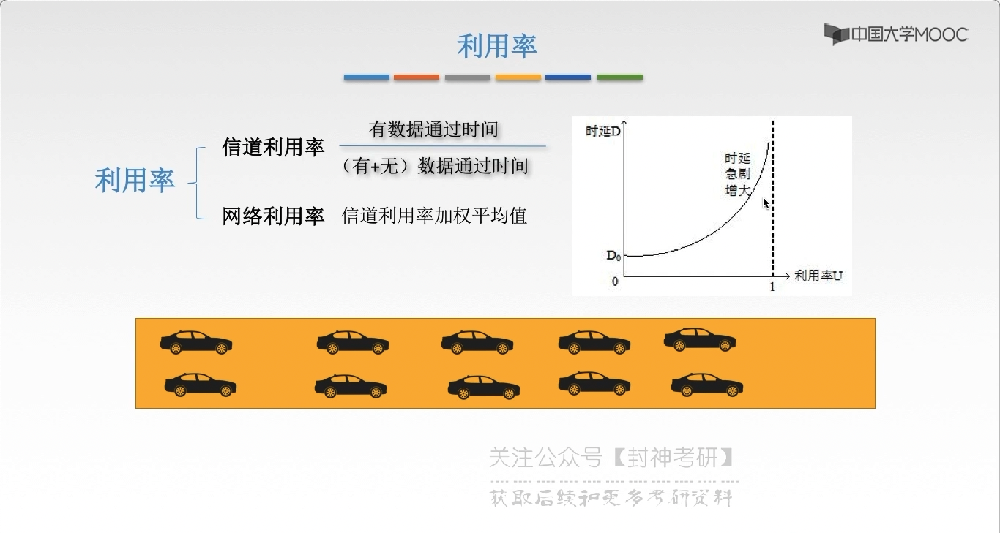

也就是：如果利用率几乎 100 % 了，时延也会很大
（就像堵车：如果三条道几乎被占满了，那么走的也会慢）

## 分层结构、协议、接口、服务

发送文件前要完成的工作：

1. 发送通信的计算机必须：将数据通信的通路进行激活（把道路给清理一下）
2. 要告诉网络：如何识别目的主机（数据传输到哪里）
3. 发起通信的计算机要查明：目的主机是否开机，并且与网络连接正常
4. 发起通信的计算机要弄清楚：对方计算机中的文件管理程序是否已经做好准备工作（是否同意接受、是否有空间存储）
5. 确保差错和意外可以解决

### 怎么分层

实体：活动元素。同一层的实体：对等实体

对等协议：只有对等实体之间才有协议

接口：

服务：下层为上层 提供服务。

分层的基本原则：

1. 各层之间相互独立，每层只实现一种相对独立的功能
2. 每层之间界面自然清晰，易于理解，相互交流尽可能少
3. 结构上可分隔开，每层都采用最合适的技术来实现
4. 保持下层对上层的独立性，上层单向使用下层提供的服务
5. 整个分层结构应该能促进标准化工作

### 认识分层结构

1. 实体：第 n 层中的活动元素，称之为 n 层实体
2. 协议：为进行网络中的 对等实体 数据交换 而建立的规则（水平方向）
   1. 语法：规定传输数据的格式，从哪个地方分割
   2. 语义：分割以后，每一段的功能
   3. 同步：规定各种操作的顺序（哪个数据包先发，哪个后发）
3. 接口（访问服务点 SAP）：上层使用下层服务的入口
4. 服务：下层为相邻上层提供的功能调用（垂直方向）

- SDU（服务数据单元）：为完成用户所要求的功能，而应传送的数据（来自上一层）
- PCI（协议控制信息）：控制协议操作的信息（来自当前层）
- PDU（协议数据单元）：PDU = PCI + SDU。对鞥层次之间传送的数据单元（作为下一层的 SDU）

- 网络体系结构是：从功能上描述计算机网络结构
- 计算机网络体系结构（简称，网络体系结构）是：分层结构
- 每层遵循：某个/些 网络协议，以完成本层功能
- 网络体系结构是：计算机网络的 各层及其协议的集合
- 第 n 层在向 n+1 层提供服务时，此服务不仅包含 第 n 层 本身的功能，还包含由下层服务提供的功能（只不过看不到罢了，透明，看下一条）
- 仅仅在相邻层间有接口，且所提供服务的具体实现细节 对上一层完全屏蔽
- 体系结构是抽象的，而实现是指能运行的一些软件和硬件

## OSI（open system internet） 参考模型

open 指的是：非垄断的

- 7 层 OSI 参考模型：物链网（通信）、传会表应（数据处理）
- 4 层 TCP/IP 参考模型

王道学的是：5 层

中间系统（像交换机、中继器不一定有处理数据的能力），因此或许只有：物链网

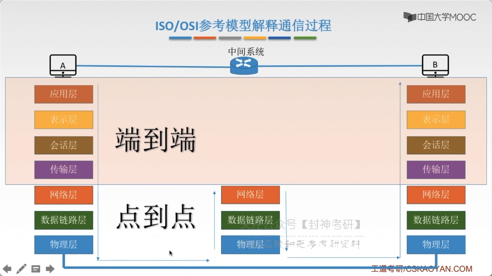

- 上面四层：端到端：客户端的 port 到服务端的 port。
- 下面三层：点到点：数据只用知道，下一层传输到哪里，传输到哪一个中继器，哪一个交换机，
  最终知道传输到哪一个主机（但是不一定知道传输到哪一个端口）

可以看到：数据链路层比较特殊，不仅加了 头，也加了 尾。
到了物理层并没有再加东西，而是一个傻瓜层，将上面的包形成一个 比特流。

因为同一层采用了同样的协议，因此知道怎么将数据包分割字段

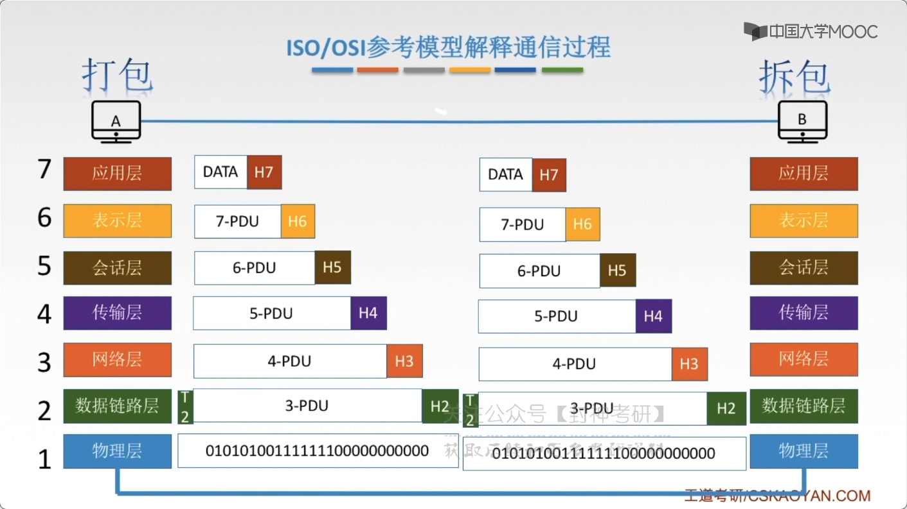

- 应用层

  所有能 和用户交互，产生网络流量的程序。
  典型引用层服务：文件传输（FTP）、电子邮件（SMTP）、万维网（WWW）

- 表示层

  用于处理在两个通信系统中 交换信息的表示方式（语法和语义）

  数据加密、解密

  数据的压缩与恢复

- 会话层

  向表示层实体/用户进程提供 建立连接 并在连接上有序的传输数据

  功能：建立、管理、终止会话

  使用 校验点 可使会话在通信失效时 从校验点、同步点 继续恢复会话，实现数据同步（不用从头传递文件）

  主要协议：ADSP、ASP

- 传输层（两大协议：TCP、UDP）

  负责主机中两个进程的通信，即 端到端 的通信。传输单位是 报文段 或 用户数据报

  功能：可、差、流、用

  可靠传输、不可靠传输

  差错控制

  流量控制（指的是 数据量匹配问题，两边发送速率要同步）

  复用分用

  复用：多个应用层进程可同时使用下面运输层的服务；
  分用：运输层把 收到的信息分别交付给上面应用层中相应的进程

- 网络层（IP 层、网际层）

  主要任务是 把 分组 从 源端 传到 目的端，为 分组交换网 上的不同主机 提供 通信服务。
  网络层 传输单位是：数据报。

  分组、数据报的关系（当数据报变大的时候，就会拆分成 小的数据报）

  路由选择。 选择最佳路径

  流量控制。 同步，传输速率同步

  差错控制。 能纠错就纠错，不能纠错就扔掉

  拥塞控制。 若宿友节点都 来不及接受分组，而要丢弃大量分组的话，网络就会处于拥塞状态。因此要采取一定措施，缓解这种拥塞

- 数据链路层

  主要任务是把 网络层 传递下来的数据报 组装成 桢。

  数据链路层的传输单位就是 桢。

  成帧：定义帧开始 和 帧结束的 01 组合

  差错控制：帧错、位错

  流量控制

  访问（接入）控制：控制对信道的访问。比方说，多人想要广播的时候，有谁可以占用信道

- 物理层

  在物理媒体上实现比特流的透明传输。物理层传输单位是 bit

  透明传输：物理层不管所传输的数据是什么样的 bit 组合，都应当能够在链路（信道）上传送。

  定义接口特性：比方说，电缆插头的引脚之类的

  定义传输模式：单工（发送端，接收端是确定的了）、半双工（同一时间只有一个人可以发送，两段都可以发送）、全双工

  定义传输速率

  比特同步

  比特编码

  常见协议：Rj45、802.3

端到端：发快递，我们只用发到正确的地址就行了，不用关注 我的寄件，下一个中转站在哪里；
点到点：一步一步走。寮步 ---> 广州 ---> 武汉 ---> 安阳 ---> 西夏寒

## TCP/IP 模型

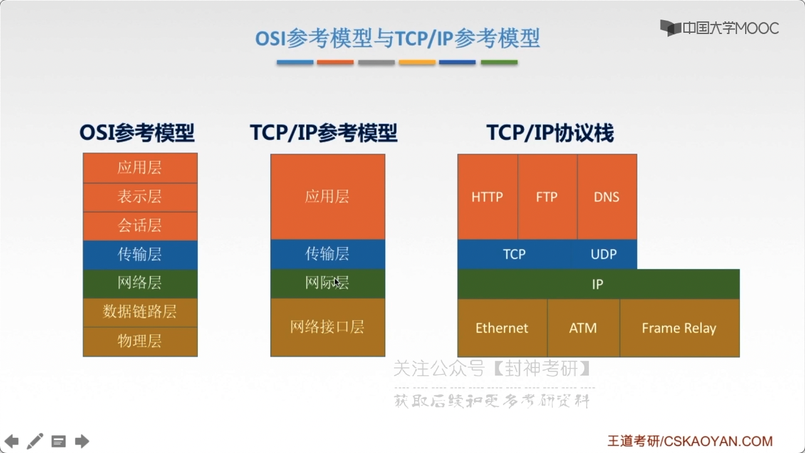

网络接口层（物链）---> 网际层（网络层）---> 传输层 ---> 应用层（会表应）；

TCP/IP 协议：Ethernet/ATM/Frame Relay ---> IP ---> TCP/UDP ---> HTTP/FTP/DNS

是先有了协议，才有的 模型

不同点：

- 面向连接：分为三个阶段：

  1.  建立连接。
  2.  只有在 建立连接之后，才能开始数据传输。
  3.  数据传输完毕后，必须释放连接。

- 无连接：没有那么多截断，直接进行数据传输

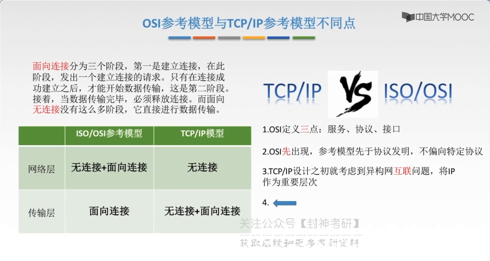

TCP/IP 注重：网络层 无连接

### 五层模型

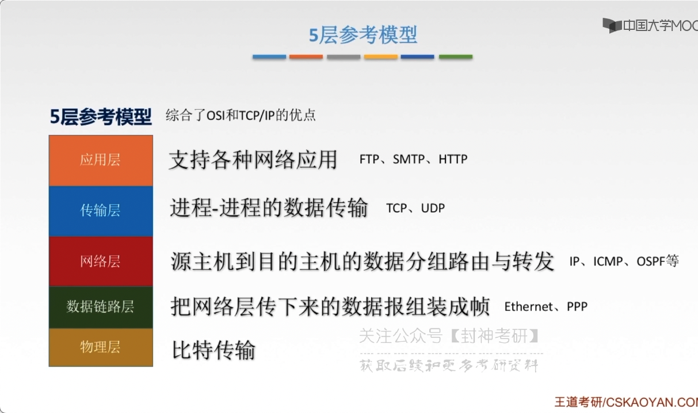

#### 数据传输

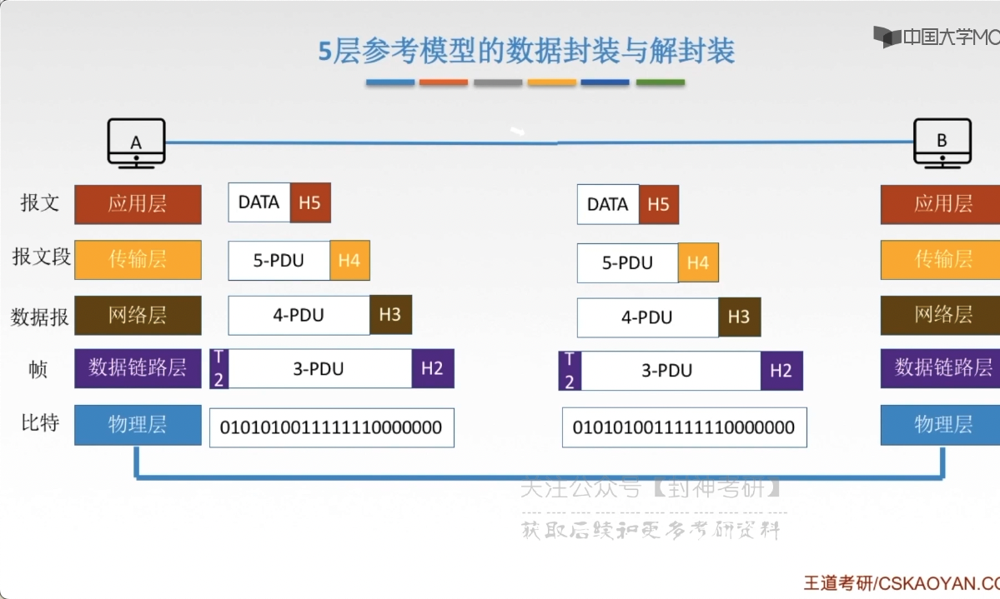
