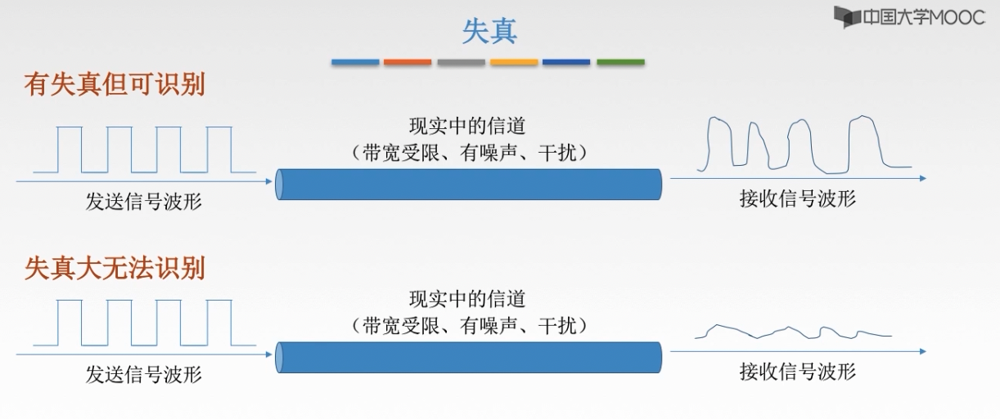
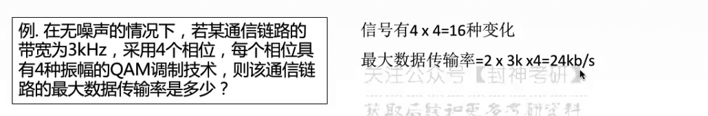
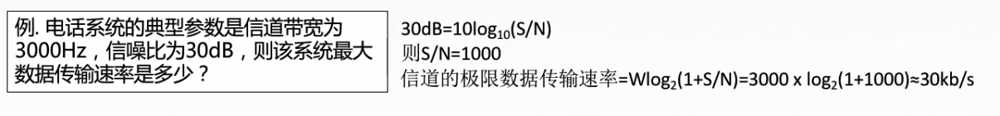

# chap2 - 物理层 - 奈式准则 与 香农定理

## 失真

失真程度的因素：

1. 码元传输速率
2. 信号船速距离
3. 噪声干扰
4. 传输媒体质量

## 码间串扰 - 一种失真现象

模拟信号的信道带宽：就是 允许通过的最高频率 - 允许通过的最低频率。

频率低，容易出现：信号衰减

码间串扰：接收端收到的信号波形 失去了码元之间清晰界限的现象（波 挨得太近了）
（比方说，一堆车从我面前经过，一堆车很快，而且挨得很近）

## 奈式准则（奈奎斯特定义）

奈式准则：在理想低通 条件下，为了避免码间串扰，极限码元传输速率为 2W Baud，W 是信道带宽（单位是 Hz），V 是 一个码元可以表示 几个 二进制位。
（低通的意思就是：低于最高频率）

奈式准则：限制了 码元传输速率的上限（还需要转化为 数据传输率）

$$
数据传输率 = 2 \times W \times \log_2^{V} (b/s)
$$

1. 在任何信道中，码元传输的速率是有上限的。

   若传输速率超过此上限，就会出现严重的码间串扰问题，使接收端对码元的完全正确识别成为不可能

2. 信道的频带越宽（即能通过的信号高频分量越多），就可以用更高的速率进行码元的有效传输

3. 奈式准则给出了 码元传输速率的限制，但没有对信号传输速率给出限制

4. 由于码元的传输速率 受奈式准则的制约，所以要提高数据的传输速率，就必须设法使每个码元能携带更多个 bit 的信息，这就需要采用 多元制 的调制方法

## 香农定理

香农定理不仅定义了 最高的传输比特率，并且考虑到了 信道之间产生的电磁 干扰。

### 信噪比

噪声存在于 所有的电子设备 和 通信信道中。由于 噪声随机产生，它的瞬时值有时会很大，因此噪声会使 接收端对码元的判决产生操作。
但是噪声的影响是相对的：若信号较强，那么噪声影响相对较小。因此，信噪比就很重要

$$
信噪比(dB) = 10 \times \log_{10}^{信号的平均功率(S) / 噪声的平均功率(N)}
$$

有两种写法吧：一种就是 S/N，一种就是 dB（dB 就类似于：科学计数法）

### 公式

香农定理：在带宽受限并且有噪声的信道中，为了不产生误差，信息的数据传输速率有上限值

$$
信道的极限数据传输速率 = W(带宽 Hz) \times log_2^{1 + S/N} (b/s)
$$

当然，注意一下，如果原本信噪比的单位是 dB，那么就需要先转换

从公式可以看出：

1. 信道的带宽 或 信道中的 信噪比越大，则 信息的极限传输速率就越高

2. 对一定的传输带宽 和 一定的信噪比，信息传输速率的上限就确定了

3. 只要信号的传输速率低于 信道的极限传输速率，就一定能找到某种方法来 实现无差别的传输

4. 香农定理得出：为极限信息传输速率，实际信道能到达的传输速率 要比他低不少

5. 从想弄定理可以看出，若 (信道带宽 W) 或者 (信噪比 S/N) 没有上限（不可能），那么信道的极限信息传递速率就没有上限

例题：

## 内忧 外患

内忧：码间串扰

外患：噪声

如果题目 给了 信噪比，那么就是用 min(奈式准则, 香农定理)

因为两个都是：规定了上限
