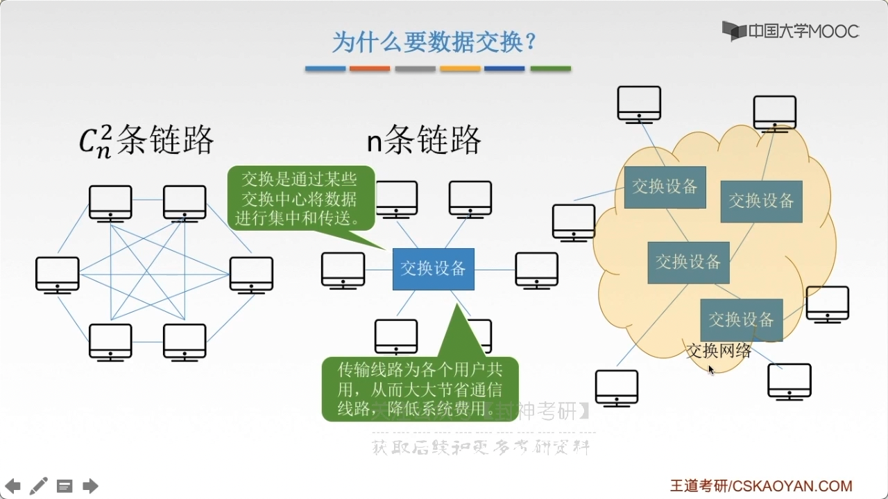
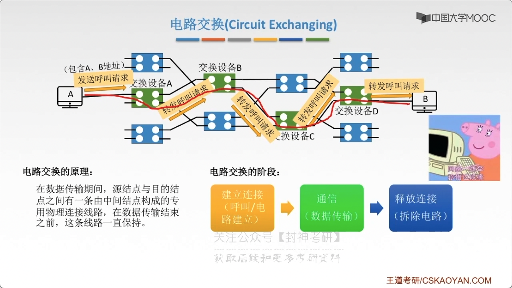
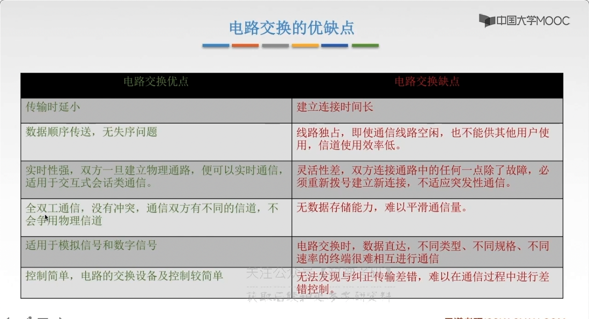
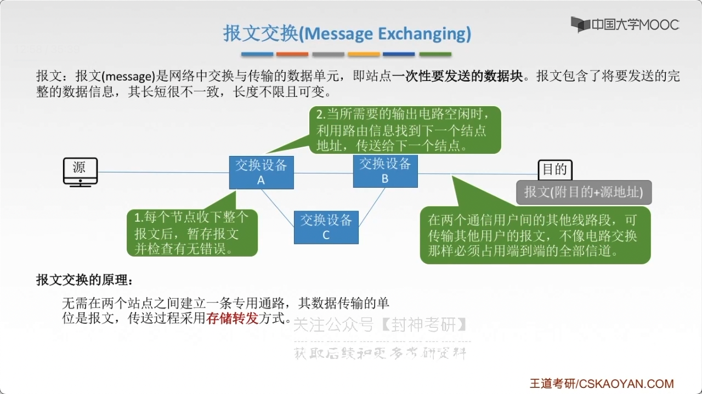
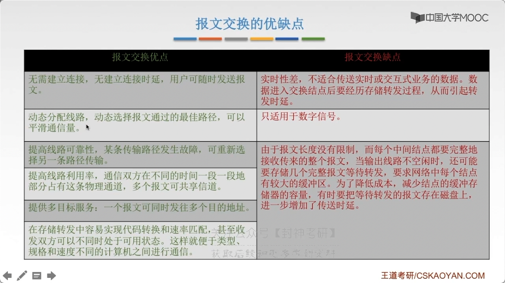
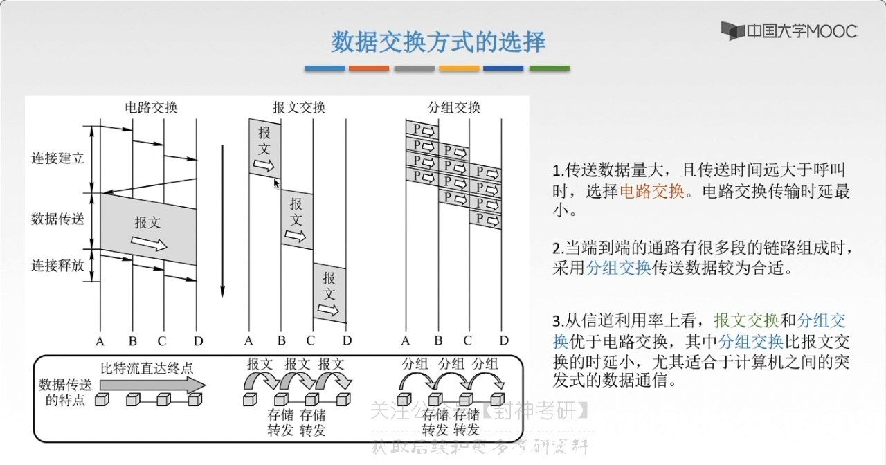
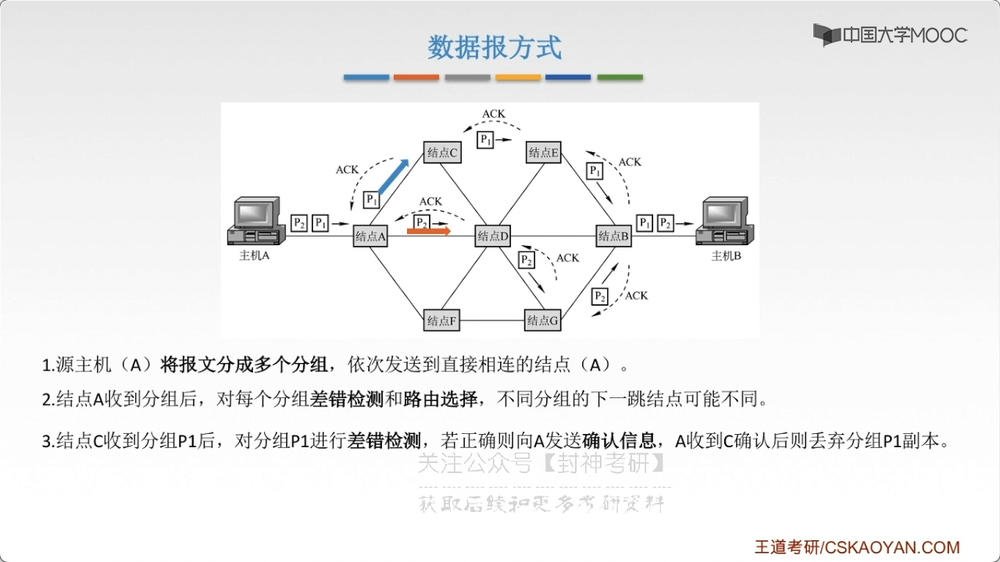
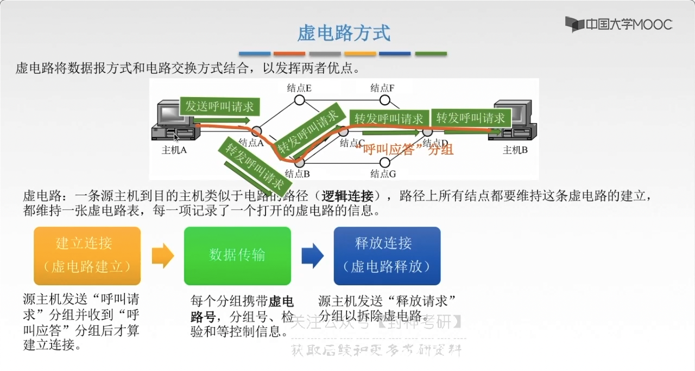
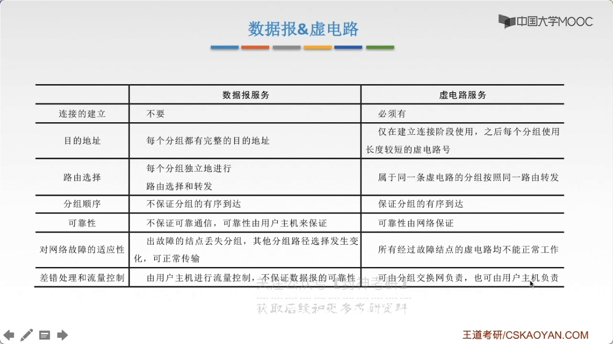

# chap2 - 物理层 - 数据交换方式

## 为什么要有 交换设备

数据交换方式：

- 电路交换
- 报文交换
- 分组交换
  - 数据报方式
  - 虚电路方式

下面两种是：存储转发式的 交换方式

## 电路交换（circuit exchanging）

在数据传输期间，src 与 dest 之间有一条 由中间节点构成的 专用物理连接线路。
在数据传输结束之前，这条线路一直保持使用。

三个阶段：

建立连接（呼叫/短路建立）---> 通信（数据传输）---> 释放连接（拆除电路）

特点：独占资源，用户使用占用 端到端的固定传输带宽。
适合用于远程批处理信号传输或系统间实时性要求高的大量数据传输的情况

电路交换需要使用 交换机

无数据存储能力：如果数据量激增，那么可能会导致数据的丢失。

## 报文交换（message exchanging）

报文：报文(message)是网络中 交换与传输的数据单元，即站点一次性要发送的数据块。
报文包含了将要发送的完整的数据信息，其长短很不一致，长度不限且可变

报文交换的原理：
无需在两个站点之间建立一条专用通路，其数据传输的单位是报文， 传送过程采用**存储转发**方式

优缺点

## 分组交换（packet exchanging）

分组：大多数计算机网络都不能连续地传送任意长的数据，所以实际上网络系统把数据分割成小块，
然后逐块发送，这种小块就称作：分组（packet）

## 如何选择

互联网中 通常是使用：分组交换的方式。

分组交换有两种方式：1) 数据报方式 2)

## 数据报方式

1. source（A）讲保温分成多个分组，一次发送到 直接相连的 node(A)
2. node(A) 收到分组后，对多个分组 差错检测 和 路由选择，不同分组的下一条节点可能不同。
3. node(C) 收到分组 p1 后，对分组 p1 进行操作检测，若正确则向 A 发送确认信息(ack)，A 收到 C 确认后则丢弃分组 p1 副本

1. 数据报方式 为网络层提供**无连接服务**。发送方可以随时发送分组，网络中的 node 可以随时接受分组

   无连接服务：不实现为分组的传输确认传输路径，每个分组独立确定传输路径，不同分组传输路径可能不同。

2. 同一报文的不同分组到大 dest 节点时，可能发生乱序、重复、丢失

3. 每个分组 在传输过程中 都必须携带 (src 地址) 和 (dest 地址)，以及分组号

4. 分组在交换节点 存储转发 时，需要排队等候，这会带来一定的时延。
   当通过交换节点的通信量较大 或者 网络发生拥塞时，这种时延会大大增加，交换节点还可以根据情况丢弃部分分组

5. 网络具有冗余路径，当某一交换节点 或者 一段链路出现故障时，可相应地更新转发表，
   寻找另一条路径转发分组，对故障的适应能力强，适用于突发性通信，不是与长保温、会话式通信

## 虚电路方式

虚电路：一条 (src 主机) 到 (dest 主机) 类似于电路的路径（逻辑连接），路径上所有 ode 都要维持这条 虚电路的建立，
都要维持一张蓄电路标，每一条都记录了 一个打开的虚电路的信息

虚电路号：用于将 分组归类，后续可以合并

1. 虚电路方式为网络层提供了**连接服务**。src node 和 dest node 之间建立一条逻辑连接，而非实际物理连接

   这里就是：连接服务。因为我们在真正传输数据之前，我们确定了一条路径。
   而无连接服务实际上可以根据负载情况 动态的

2. 一次通信的所有分组都通过徐电路顺序传送，分组不需要携带 (src 地址)、(dest 地址)等信息。包含虚电路号，
   相对数据报方式开销小，同一报文的不同分组到达 (dest node)不会乱序、重复或丢失

3. 分组通过虚电路上的 每一个节点时，节点只进行差错检测，不需要进行路由选择

4. 每个 node 可能与多个 node 之间建立多条虚电路，每条虚电路支持特定的两个 port 系统之间的 数据传输，
   可以对两个数据端点的流量进行控制，两个端系统之间也可以有多条虚电路为不同的进程服务

5. 致命弱点：当网络中的某个 node 或者 某条链路出现故障而彻底失效时，
   则所有经过该 node 或者该链路的虚电路都将遭到破坏

