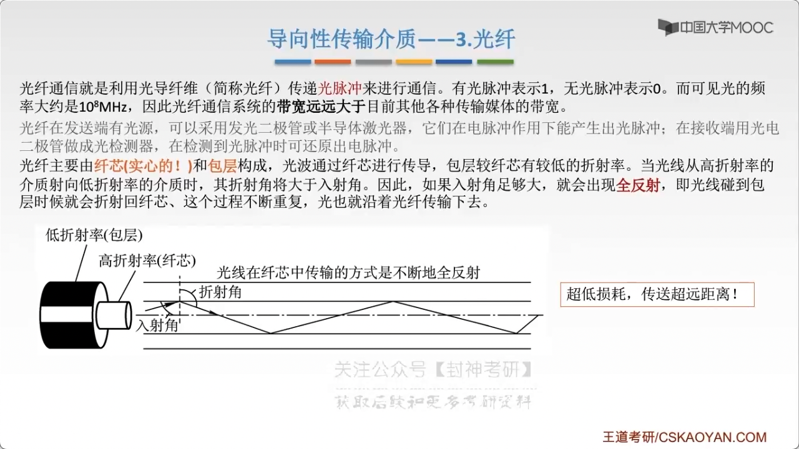

# chap2 - 物理层 - 传输介质及分类

传输介质也称为 传输媒体/传输媒介，他就是 数据传输系统中 在发送设备 和 接受设备之间的 **物理通路**

传输媒体并不是物理层。
传输媒体在物理层下面，因为物理层是体系结构的第一层，因此有时称传输媒体为 第 0 层。
在传输媒体中传输的是信号，但传输媒体并不知道 所传输的信号代表什么意思。
但物理层规定了 **电气特性**，因此能够识别所传送的 bit 流

传输介质：

- 导向性传输介质：电磁被导向 沿着某个固体媒介（铜线、光纤）传播
- 非导向性传输介质：自由空间，介质可以是：空气、海水

## 导向性 介质

### 双绞线

双绞线：最古老、又最常用的传输介质，他由两根采用一定规则 并排绞合的、相互绝缘的铜导线组成。
绞合可以减少相邻导线 的电磁干扰。

为了进一步提高抗干扰能力，可在双绞线的外面再加上一个由 金属丝 编织成的 屏蔽层，
这就是 屏蔽双绞线（STP），无屏蔽层的双绞线就被称为 非屏蔽双绞线（UTP）

8 条线

可以传输 数字信号（中继器）、模拟信号（放大器）

### 同轴电缆

同轴电缆分为两种：

- $50\omega$，传送基带数字信号，局域网中很常用
- $75\omega$，宽带同轴电缆，有线电视

### 光纤

通过：光脉冲进行通信。带宽很大

光纤：纤芯（实心的） + 包层

分为：

- 多模光纤：比较粗，反射比较多，但是全反射会有损耗，容易失真，适合近距离传输
- 单模光纤

1. 传输损耗小，中继距离长，对远距离传输好
2. 抗雷电 和 电磁干扰性好
3. 无串音干扰，保密型号，不易被窃听或者截取数据
4. 体积小，重量轻

## 非导向性 介质

- 无线电波：所有方向

- 微波：固定方向

  频率高，频段范围宽，数据率很高

  应用于：地面微波接力通信（地面上的中继站）、卫星通信

- 红外线、激光：固定方向

  把传输的信号分别转换成各自的信号格式

这三种称之为：视线介质
