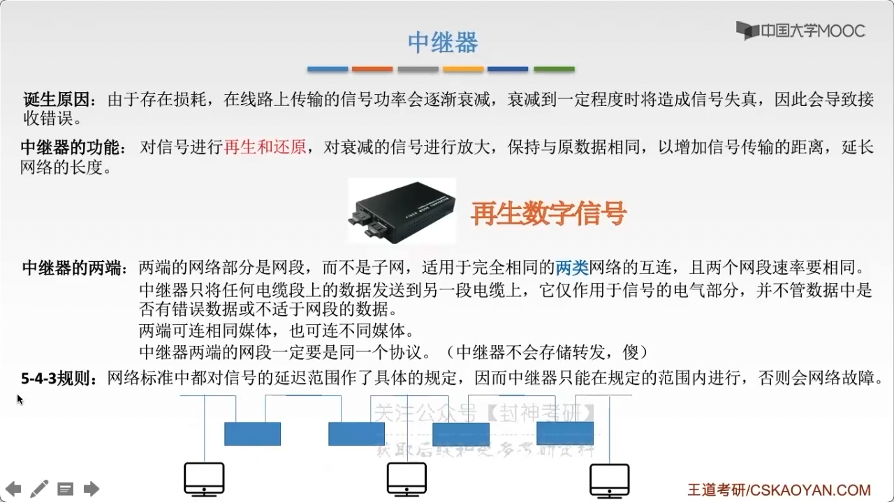
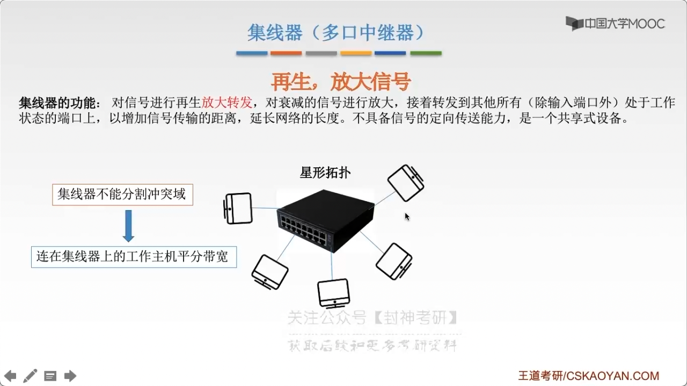

# chap2 - 物理层 - 物理层的设备

## 中继器

诞生原因：由于存储损耗，在线路上传输的信号功率会逐渐衰减，衰减到一定程度时将造成信号失真，因此会导致接受错误

中继器的功能：对信号进行**再生和还原**，对衰减的信号进行放大，保持与原数据相同，以增加信号传输的距离，延长网络的长度。（**再生数字信号**）

- 中继器的两端：两端的网络部分是网段，而不是子网（数据链路层），
  适用于完全相同的两类网络的互联，且两个网段速率要相同。

- 中继器只将：任何电缆段上的数据发送到另一段电缆上，他仅作用于信号的电气部分，
  并不管数据中是否有错误数据 或者不适于网段的数据。

- 中继器的两端可以连相同媒体，也可以连接不同媒体。

- 中继器两端的网段一定要是同一个协议

5-4-3 规则（5 个网段、4 个中继器或者集线器、3 个计算机）：网络标准中都对信号的延迟范围做了具体的规定，
因而中继器只能在规定的范围内运行，否则会网络故障

## 集线器（多口中继器）

集线器的功能：对信号进行再生放大，对衰减的信号进行方法，接着转发到其他所有（除输入端口外）处于工作状态的端口上，
以增加信号传输的距离，延长网络的长度。不具备信号的定向传送功能（广播），是一个共享式设备。

因为是广播，可能会导致 冲突。

集线器不能分割冲突域。会导致：连载集线器上的主机平分带宽

