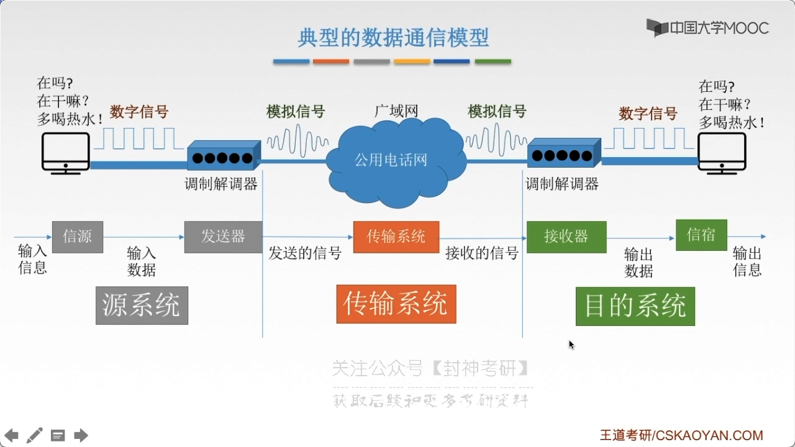
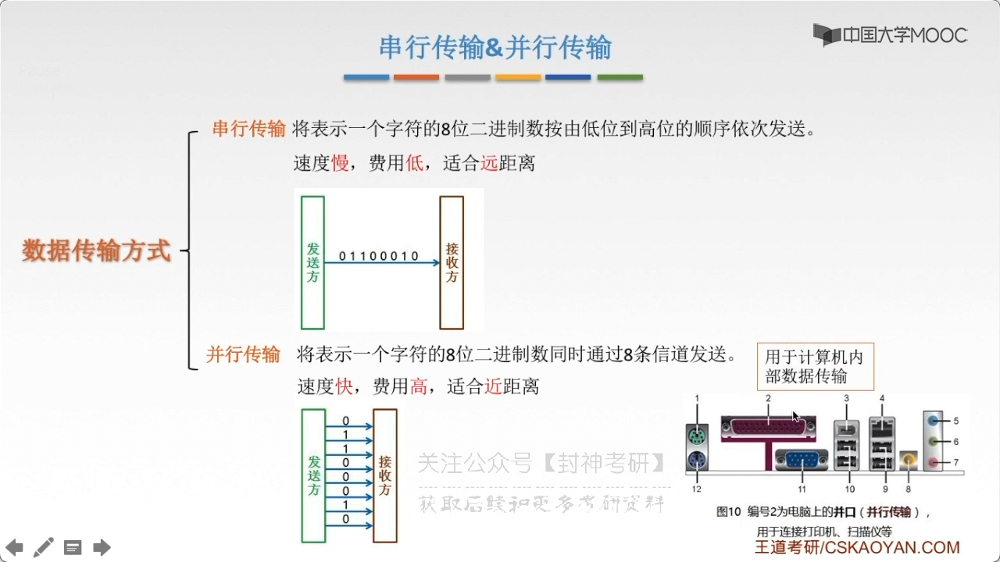
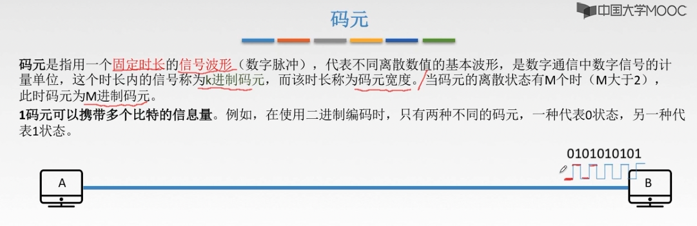

# chap2 - 物理层 - 基础知识

物理层解决：如何在连接各种计算机的传输媒体上 传输数据 bit 流，而不是指具体的 传输媒体。

物理层主要任务：确定与传输媒体接口有关的一些特性（定义标准）

- 机械特性：定义屋里连接的特性，规定物理连接时所采用的规格、接口形状、引线数目、引脚数量、排列情况
- 电气特性：规定传输二进制位时，线路上信号的电压范围、阻抗匹配、传输速率、距离限制（物理上的）
- 功能特性：指明某条线上出现的某一电平表示何种含义（逻辑上的），接口部件的信号线用途
- 规程特性：（过程特性）定义各条物理线路的工作规程和时序关系

典型的数据通信模型：

## 数据通信相关术语

通信的目的是 传送消息

- 数据 data：传送信息的实体，通常是有意义的符号序列
- 信号：数字信号、模拟信号
- 信源 source
- 信宿 destination
- 信道
  - 信号类型：模拟、数字
  - 介质：无线、有线

## 三个问题

设计数据通信系统要考虑的三个问题：

1. 单工？半双工？全双工？
2. 串行？并行？
3. 同步？异步？

### 单工？半双工？全双工？

单工：只需要一条信道

(半/全)双工：需要两条信道

### 串行？并行？

### 同步？异步？

同步传输：在同步传输的模式下，数据的传送是以一个数据区块为单位，因此同步传输又称为区块传输。
在传输数据时，需要先送出 1 个 或者 多个 同步字符（相当于，跳广播体操的时候，要先预备 5678），再送出整批数据

异步传输：异步传输将 bit 分成小组进行传送，小组可以是 8 位 的 1 个字符或者更长。
发送方可以在任何时刻发送这些比特组，而接收方不知道他们会在什么时候到达。
传送数据时，加一个字符起始位 和 一个字符终止位（为了让 接收方知道这个是数据，不是噪声）

## 相关术语

### 码元

码元：用一个固定时长的信号波形（数字脉冲），代表不同离散数值的基本波形，是数字通信中 数字信号的计量单位，
这个时长内的信号称为 k 进制码元，而该时长称为 码元宽度。当码元的离散状态有 M 个时（M 大于 2），此时码元为 M 进制码元

1 个码元可以携带多个比特的信息量

这个例子中，信号只有两种状态：高电平，低电平，那么就是 2 进制码元。

然后这个 低电平状态 或者是 高电平 状态持续了多长呢？码元宽度。

如果是 四进制码元，有 4 个状态，那么就需要 2 个二进制位。也就是 一个 4 进制码元，可以携带 2 个 bit 的信息量。

### 速率、波特

速率（数据率），指：数据的传输速率，表示单位时间内传输的数据量。可以用 1)码元传输速率 和 2)信息传输速率 表示。

#### 码元传输速率

码元传输速率：（又称 码元元速率、波形速率、调至速率、符号速率），他表示 单位时间内 数字通信系统 所传输的码元个数
（也可以称为 脉冲个数 或者 信号变化的次数，注意，如果发生了 低电平 ---> 低电平，也认为是发生了状态的改变）。
单位是：波特（Baud）。1 波特表示数字通信系统 每秒传输一个码元。

码元速率（$R_B$）与进制数 无关，只与 码元长度（$T$）有关，$R_B = \frac{1}{T}$，单位（$B$）

#### 信息传输速率

信息传输速率：（又称 信息速率、bit 率等），他表示 单位时间内 数字通信系统 传输的 二进制码元个数（即 bit 数），
单位是：b/s

关系：若 一个码元携带 n bit 的信息量，则 M Baud 的码元传输速率所对应的信息传输速率为 $M \times n (bit/s)$

A.K.A(as known as，即)

### 带宽

#### 模拟

模拟信号系统中：当出入的信号频率 高或低 到一定程度，使得系统的传输功率 称为输入功率一半时，
最高频率 和 最低频率 间的差值就代表了系统的 通频带宽，其单位为 Hz

#### 数字

数字设备中：表示在 单位时间内 从网络中的某一点 到 另一点，所能通过的 “最高数据率” / 单位时间内通过链路的数量，
常用来表示网络的通信线路所能传输数据的能力。单位是：bps（bit/s）

我的评价是：水管的宽度。高速公路的宽度
