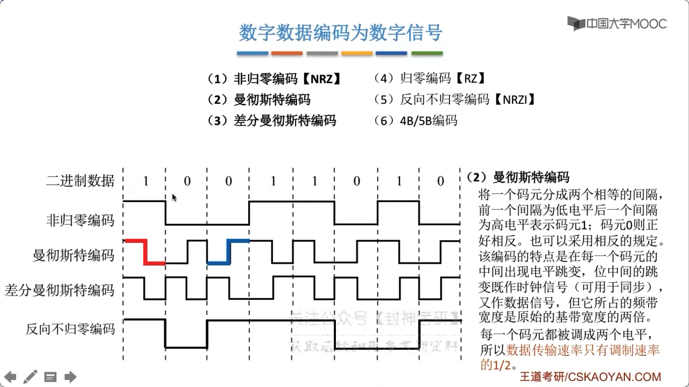
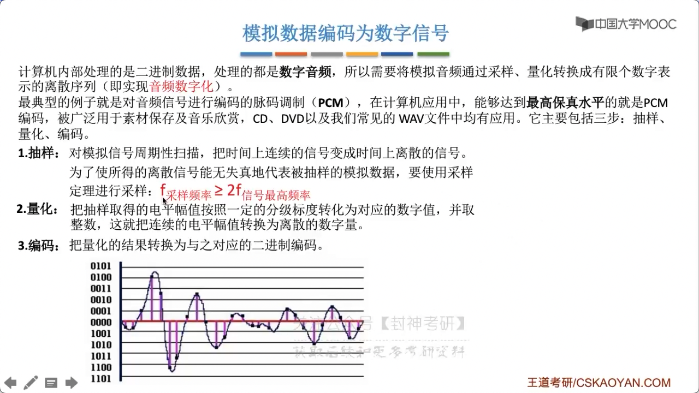

# chap2 - 物理层 - 基带信号 与 宽带信号

信道：信号的传输媒介。一般用来表示 向某一方向传送信息的介质，
因此一条通信线路往往包含 一条发送信道 和 一套接受信道

信道：

- 传输信号
  - 模拟
  - 数字
- 介质
  - 无限
  - 有线
- 传送的信号
  - 基带信号
  - 宽带信号

1. 基带信号（计算机发送的就是数字的）

基带信号：将数字信号 1 和 0 直接用两种不同的电压表示，再送到数字信号上去传输（基带传输）。
**来自信源**的信号，像计算机输出的代表各种文件或图像文件的数据信号 都属于基带信号。
基带信号就是发出的直接表达了要传输的信息的信号，比如我们说话的声波就是基带信号。

来自信源的信号，然后编码，发送。编码可以是：边缘触发、水平触发

2. 宽带信号（模拟信号）

将基带信号进行调至后，形成的频分复用模拟信号，再传送到模拟信道上传输。

把几代信号经过 载波调制（频率提高，应对信号衰减的情况） 后，把信号的 频率范围搬移到较高的频段，一边在信道中传输
（即仅在一段频率范围内能够通过信道）

- 近的时候，基带传输
- 远的时候，宽带传输

- 数字数据 ---(数字发送器)---> 数字信号 （编码）
- 数字数据 ---(调制器)---> 模拟信号 （调制）

- 模拟数据 ---(PCM 编码器)---> 数字信号 （编码）
- 模拟数据 ---(放大器调制器)---> 模拟信号 （调制）

## 数字数据 编码为 数字信号（基带信号）

- 非规定编码 NRZ

  高 1 低 0，编码容易实现，但是没有检错功能，且无法判断一个码元的开始和结束，以至于 收发双方都难以保持同步
  （比方说，发送方发送了一长条 1，那么接收方其实没法同步的）

- 归零编码 RZ

  信号电平在一个码元内都要恢复为 0 这种编码方式
  （出于低电平时间段非常多，其实这个变向的也就是：一长条 0，不推荐）

- 反向不归零编码 NRZI

  信号电平翻转表示 0，信号电平不变表示 1。
  这个编码不错，但是还是有问题：如果 全 1 数据，全 1；全 0 数据，全 1，无法区分

- 曼彻斯特编码（强推）

  结合了上面 三种编码的特点。

  将一个码元分成两个相等的间隔，（前一个间隔为低电平，后一个间隔为高电平，表示码元 1）（码元 0 则正好相反）。也可以采用相反的规定。
  该编码的特点是：在每一个码元的中间出现电平调变，为中间的调变视为 时钟信号（可用于同步），又作数据信号。

  但它占用的频带宽度是 原始的基带宽度的两倍。数据传输速率只是调制速率的 1/2。如何理解？
  码元长度结束以后，新一段开始，这是 1，码元长度中间出现了 调变，这也是 1。一个时间周期内，脉冲个数是 2。
  如果一个 信道他的码元传输速率是 40 Buad，那么他对应的 数据传输速率只有 20 b/s

- 差分曼彻斯特编码

  同 1 异 0
  (若码元为 1，则前半个码元的电平 与 上一个码元的后半个电平相同)，（若码元为 0，则相反）。
  该编码的特点是：在每个码元的中间，都有一次电平的条换，可以实现自同步，且抗干扰强于 曼彻斯特编码

  常用于 局域网传输

- 4B/5B 编码

  比特流中插入额外的 bit 以打破一连串的 0 或 1。就是用 5 个 bit 来编码 4 个 bit 的数据，
  之后再传给 接收方。编码效率为 80%。
  5 个 bit 可以保存 32 种状态。我们这里实际上只有 4 个 bit 作为数据，只有 16 中状态。
  剩下的 16 中状态作为控制码（帧的开始和结束，线路的状态信息等）

## 数字数据 调制为 模拟信号

数字数据调至技术在 发送端 将 数字信号 -> 模拟信号；而在接收端讲 模拟信号 -> 数字信号，
分别对应于调制解调器的 调制 和 解调过程

2ask ，0 没有振幅，1 有振幅

2fsk ，0 低频，1 高频

2psk ，0 对应于一种相位，1 对应于另一种相位

## 模拟数据 编码为 数字信号

计算机内部处理的是 二进制数据，处理的都是 数字音频，
所以需要将模拟音频通过 采样、量化转换成 有限个数字表示的离散序列（即实现音频数字化）

最典型的例子就是：对音频信号进行编码的脉码调制（PCM），有最高保真水平。
包含三步：抽样、量化、编码

1. 抽样

   对模拟信号进行周期性扫描，把时间上连续的信号编程实际上离散的信号。
   为了使得离散信号能乌石镇地代表背抽样的模拟数据，要使用采样定义进行采样：

   $$
   f_{采样频率} \ge 2 \times f_{信号最高频率}
   $$

   根据：复变，傅里叶变化。所有的波形都是可以用 正弦波 叠加出来的。
   对于一个正弦波来说，只要知道两个点（当然，前提是我们知道了 频率）就可以知道，
   $y = A \sin{\omega t + \phi}$

2. 量化

   把抽样取得的 电平幅值按照一定的分级标度 转化为 对应的数字值，
   并取整数，这就把连续的电平幅值 转换为 离散的数字量

3. 编码

   把量化的结果转化为 与之对应的 二进制编码

