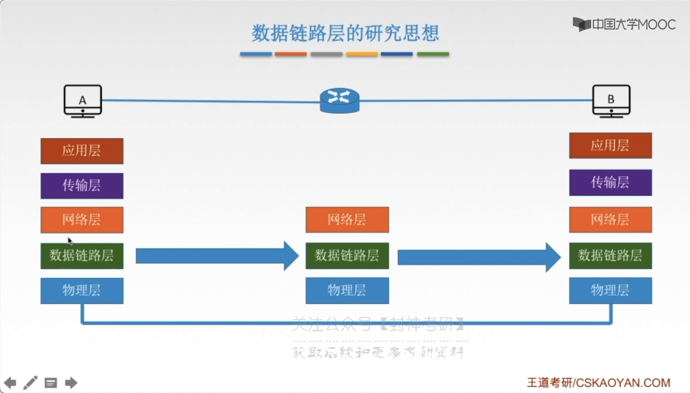
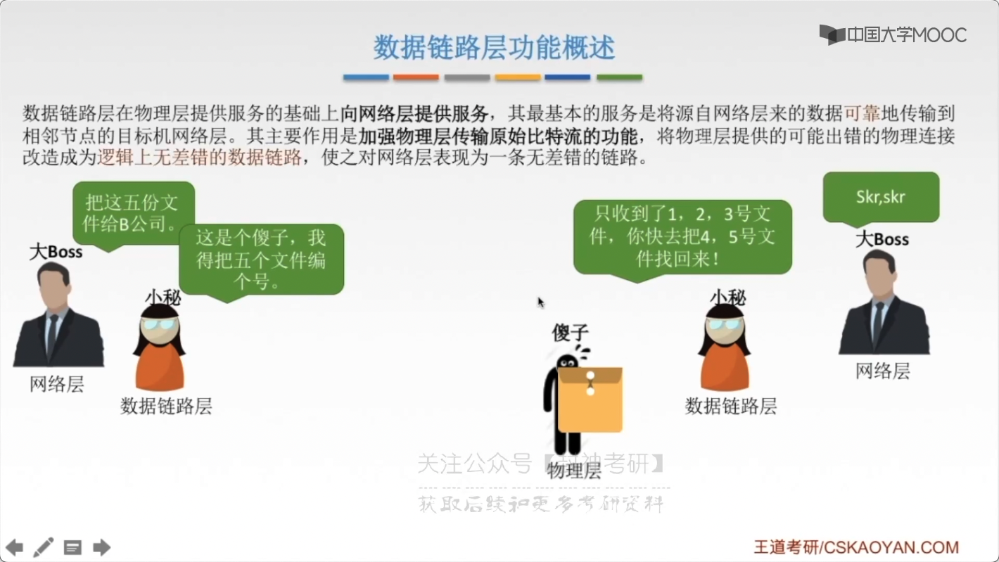

# chap3 - 数据链路层 - 功能

1. 功能

   1. 封装成帧（帧，传输单位）、透明传输

   2. 差错控制

      1. 位错（bit 发生了错误）
         - 检错编码 ---> 重传帧
         - 纠错编码
      2. 帧错 ---> 定时器、编号机制

   3. 流量控制

   4. 可靠传输（是链路层的一个特点）

   流量控制、可靠传输，用了 滑动窗口的算法

2. 应用

   1. 两种链路、信道

      1. 点对点（广域网）

   2. 广播（局域网）

      - 介质访问控制
        - 静态划分信道
      - 动态划分信道

   3. 链路层设备

      交换机、网桥等

## 数据链路层的研究思想

实际上研究，只用研究：水平方向上就行了。

## 术语

结点：主机、路由器

链路：网络中两个结点之间的**物理通道**，链路的传输介质主要有：双绞线、光纤、微波。分为有线、无线

数据链路：网络中两个结点之间的**逻辑链路**，把实际控制数据传输协议的硬件和软件加到链路上就构成数据链路

帧：链路层的协议数据单元，封装网络层数据报

数据链路层负责通过 一条链路，从一个结点向另一个物理链路直接项链的相邻结点传送数据报

## 功能概述

数据链路层在物理层提供服务的基础上，向**网络层提供服务**，
其最基本的服务是：将源自网络层来的数据可靠的传输到 相邻结点的目标机网络层。
其主要作用是**加强物理层传输原始 bit 流的功能**。
将物理层提供的可能出错的物理连接，改造成逻辑上无差错的 数据链路，
使之队网络层 表现为一条无差错的链路

给网络层好像觉得，好像没出现什么差错

功能：

1. 为网络层提供服务。无确认无连接服务（适合误码率比较低的信道）、有确认无连接服务、有确认面向连接服务

   连接：的含义在物理层提到了，就是在数据真正开始传输之前，确定一条线路

   确认：无确认就是，目标主机不会进行确认，数据也不会重发（不太负责）

   有连接一定有确认，不存在：有链接无确认的服务

2. 链路管理，即连接的建立、维持、释放（用于面向连接的服务）

3. 组帧

4. 流量控制

   限制发送方，让发送方慢一点

5. 差错控制（帧错、位错）
