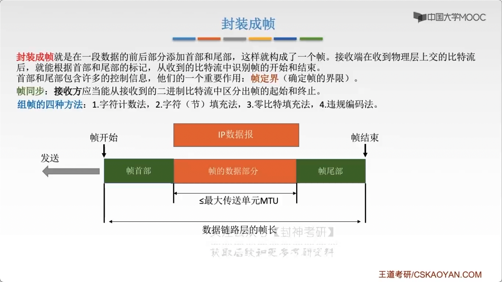
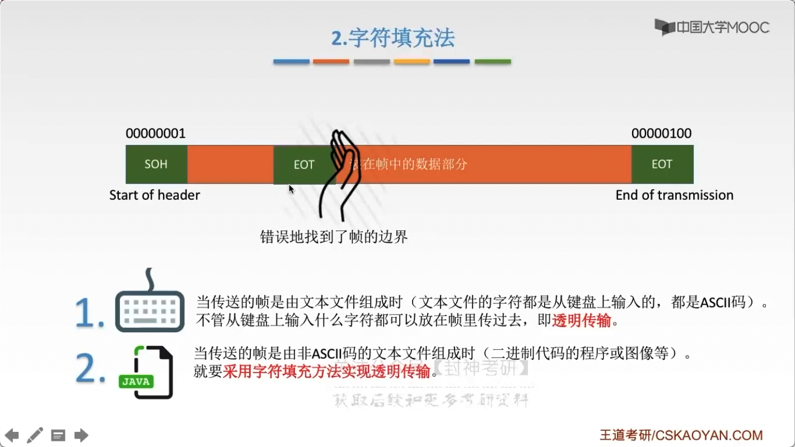
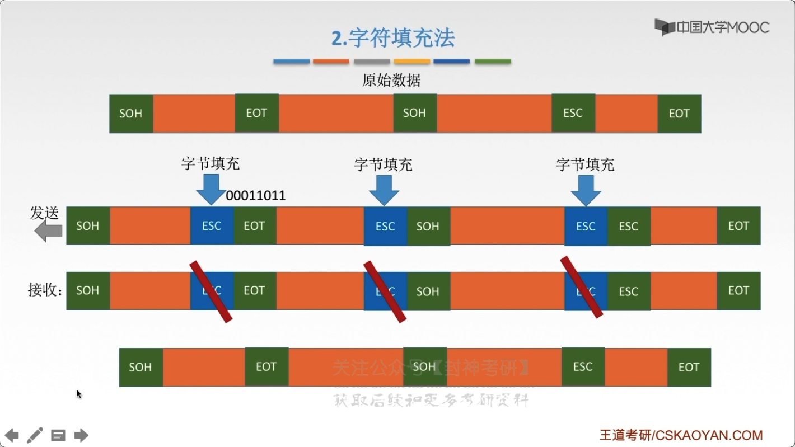
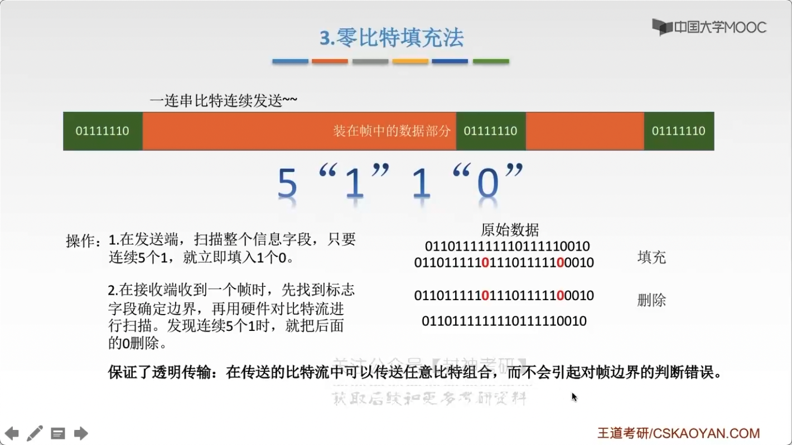

# chap3 - 数据链路层 - 组帧

## 封装成帧

封装成帧：在一段数据的前后部分添加 首部、尾部，这样就构成了一个帧。
接收端在接收到物理层 上交的 bit 流后，就能根据首部、尾部的标记，从收到的 bit 流中识别帧的开始和结束

首部尾部包含许多的控制信息，他们的一个重要作用：帧定界（确定帧的界限）

帧同步：接收方应当能从 接收到的 二进制 bit 流中 区分出帧的起始和终止

组帧的 四种方法：

1. 字符计数法
2. 字符（节）填充法
3. 零 bit 填充法
4. 违规编码法

目前比较常见的帧同步法：bit 填充法、违规编码法

## 透明传输

透明传输是指：不管所传数据是什么样的 bit 组合，都应当能够在链路上传送。因此，链路层就 “看不见” 有什么妨碍数据传输的东西。

当所传数据中的 bit 组合恰巧与某一个控制信息完全一样时，就必须采取适当的措施，
使接收方不会将这样的数据误认为是某种控制信息。这样才能保证数据链路层的传输是透明的

## 字符计数法

帧首部使用 一个技术字段（第一个字节，八位）来标明 帧内字符数

错位的话就会导致 严重错误（不常用）

## 字符填充法

链路层有两个标识符：start of header、end of transmission

这要有一个问题：就是我们这个标识符，不能与数据部分有重复。
比方说英文字符是：0~127，那么我们可以用：128~255

为了避免严重错误，我们需要用：字符填充法

在数据部分的： EOT 、 SOH 前面添加一个 字节填充（转义字符）

## 零 bit 填充法

假设：eot 和 soh 都是`01111110`

操作：

发送端：扫描整个信息字段，只要连续 5 个 1，就立即填入 1 个 0

接收端：在接收端收到一个帧时，先找到标志字段确定边界，再用硬件比 bit 流进行扫描。
发现连续 5 个 1 时，就把后面的 0 删除

保证了透明传输：在传送 bit 流中可以传送任意 bit 组合，
而不会引起帧边界的判断错误

## 违规编码法

曼彻斯特编码法：高-低(1)、低-高(0)。一个码元长度内不会出现：高-高、低-低 的情况。
可以用：高-高、低-低 来定界 帧的起始 和 终止

比较常用，因为实现起来比较简单，局域网的 IEEE802 标准就采用了这种方式。
