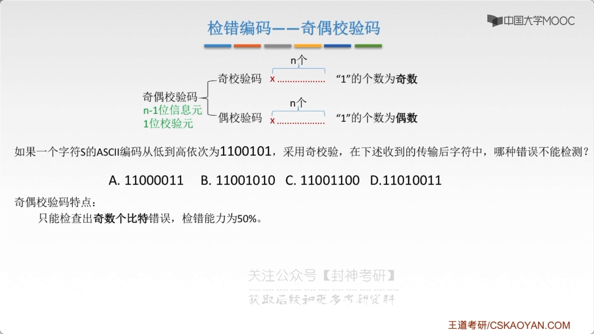
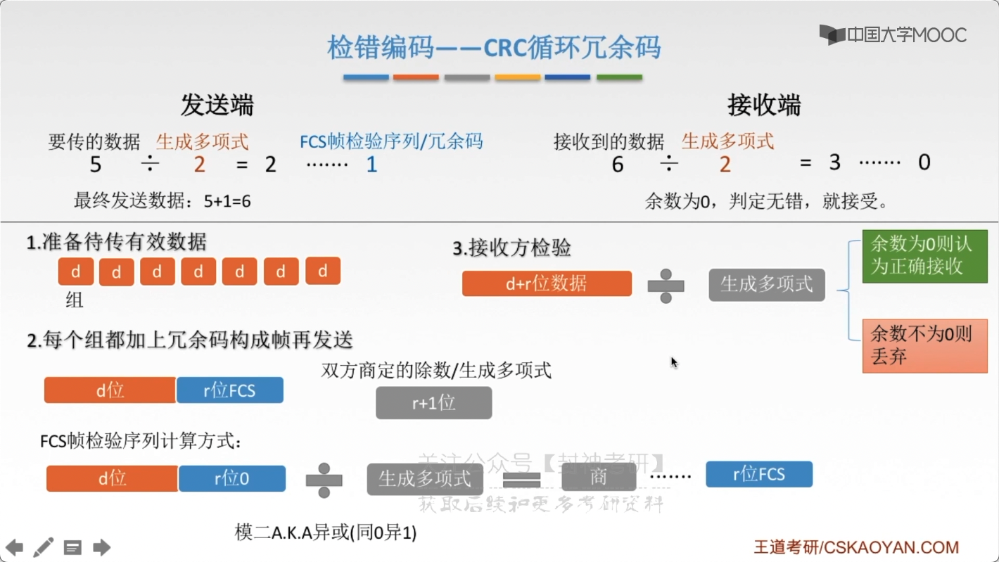
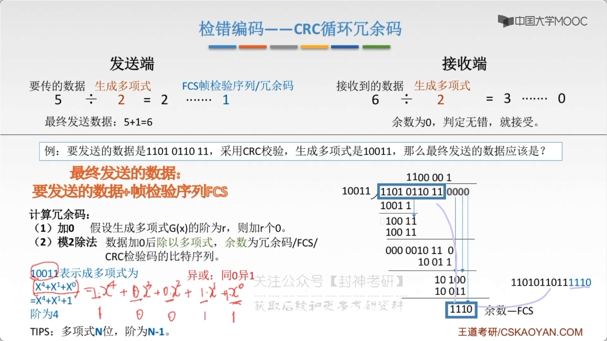
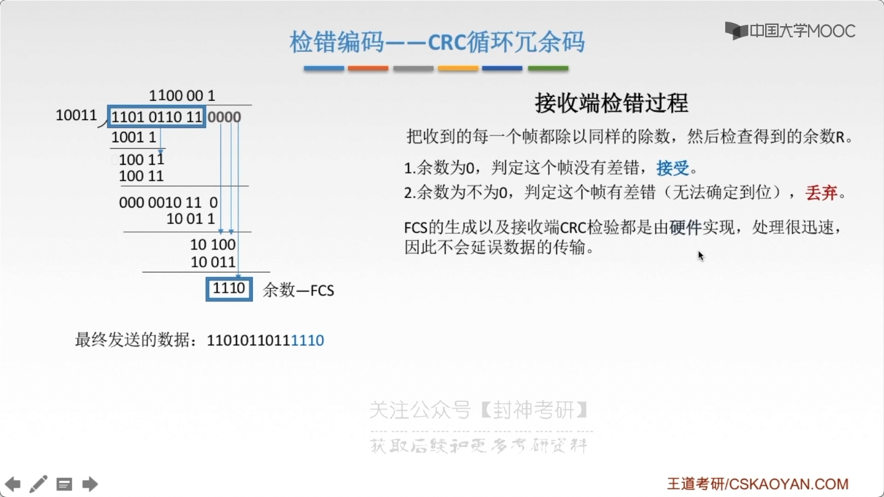
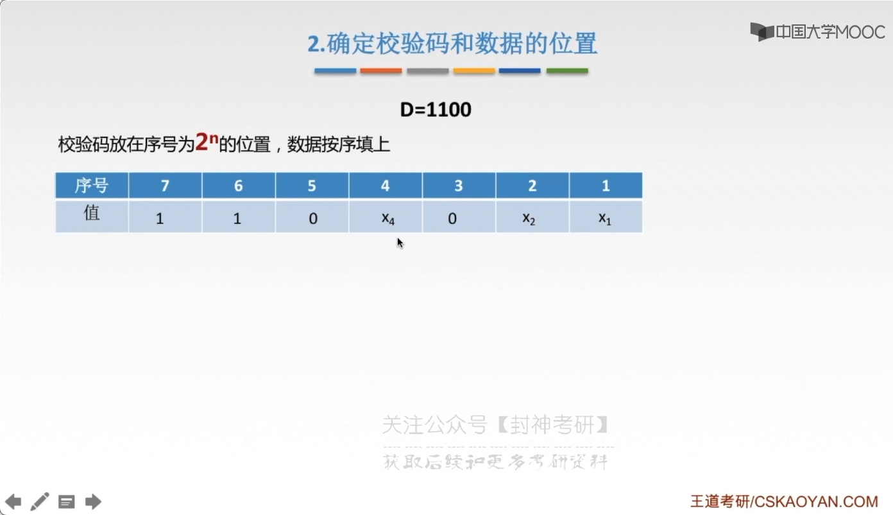
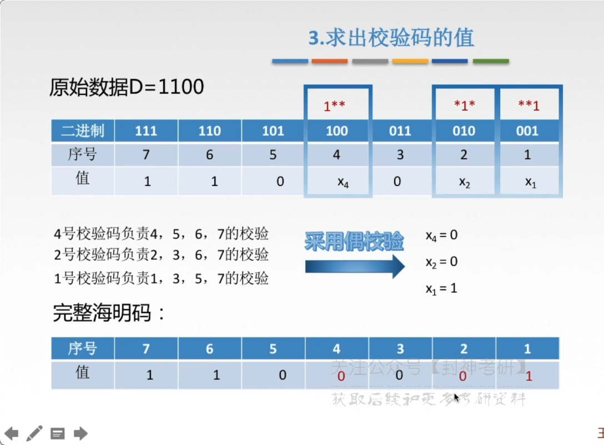
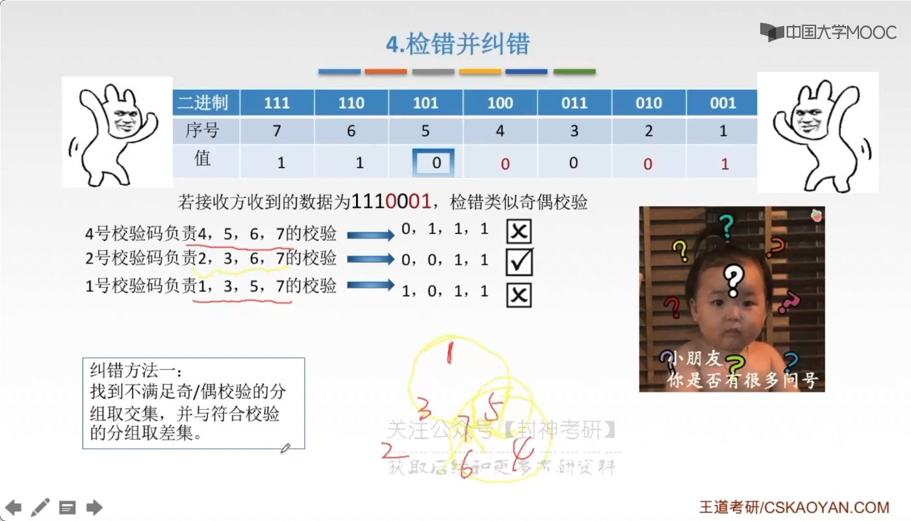
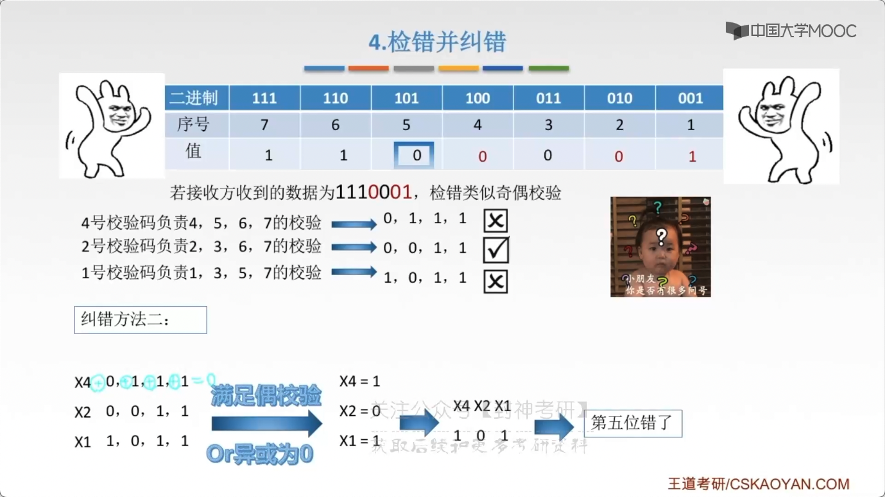

# chap3 - 数据链路层 - 差错控制

概括来说，传输中的 差错都是由于 噪声引起的

1. 全局性：由于线路本身的电气特性所产生的随机噪声（热噪声），使信道固有的，随机存在的

   解决方法：提高信噪比（对传感器下手）

   误码率 = 发生差错的 bit / 总发射的 bit

2. 局部性：外部特定的短暂原因 所造成的 冲击噪声，使产生差错的主要原因

   解决方法：通常利用编码技术来解决

两种差错：

1. 位错：bit 位出错，1-->0、0-->1
2. 帧错
   - 丢失：`[#1]-[#3]`
   - 重复：`[#1]-[#2]-[#2]-[#3]`
   - 失序：`[#1]-[#3]-[#2]`

当然，随着材料方面的进步，无确认无连接服务也很常见了

## 差错控制

- 检错编码
  - 奇偶校验码
  - 循环冗余码 CRC
- 纠错编码
  - 海明码

数据链路层的编码 与 物理层的数据编码与调制不一样。
物理层编码针对的是 单个 bit，解决传输过程中 bit 的同步问题。
而数据链路层的编码针对的是 一组 bit，
他通过 冗余码的技术 实现 一组二进制 bit 串在传输过程中是否出现差错

冗余编码：在数据发送之前，按照某种关系附加上一定的荣誉为，构成一个符合 某一个规则的码字后再发送。
当腰发送的有效数据变化时，相应的冗余位也随之变化，使码字遵从不变的规则。
接收端根据收到码字是否仍符合元规则，从而判断是否出错

## 奇偶校验码

不能检测出：发生偶数个错误的情况，检错能力为 50%

## CRC 循环冗余码

生成多项式（被除数），如果是 $x^3 + x^2$ 等价于`1100`

1. 准备待传 有效数据

2. 每个组都加上冗余码构成帧 再发送

3. 接收方检验

发送方：

接收方：

接收端进行 mod2 除法。我们上面把余数加上了，那么可以整除

这在数据链路层，仅仅使用 CRC 差错检测技术，只能做到对帧的无差错接收，
即 “凡是接收端链路层接受的帧，我们都能以非常接近于 1 的概率认为这些帧在传输过程中没有产生差错”。
接收端丢弃的帧虽然曾收到了，但是最终没有因为有差错被丢弃。“凡是接收端链路层接受的帧 均无差错”

“可靠传输”：数据链路层发送端发送什么，接收端就收到什么

链路层使用 CRC 检验，能够实现 无 bit 差错的传输，但这还不是可靠传输

## 海明码（纠错编码）

上面两种编码，只是可以知道发生了错误，无法纠错。

只要知道发生错误的位置，将该位置 bit 翻转即可（纠正错误）

工作流程：

1. 确定校验码位数 r
2. 确定校验码和数据的位置
3. 求出校验码的值
4. 检测并纠错

海明距离

两个合法编码（码字）的对应 bit 取值不同的 bit 数称为 这两个码字的 **海明距离（码距）**，
一个有效的编码集中，任意两个合法编码的海明距离的最小值称为 该编码集的 **海明距离（码距）**

如果一个编码集中的 码距是 1 的话。如果出现了错误，那么依然是在这个编码集里面，无法检测出错误。

如果编码集中的 码距是 2 的话。出现了错误，那么往两边的码距都是 1，可以检测出错误，但是无法被纠正。

如果码距是 3

检测出错误：d+1；纠正错误：2d+1

### 1. 确定校验码位数 r

数据/信息有 m 位，冗余码/校验码有 r 位

校验码一共有 $2^r$ 种取值

数据有 m 位置，校验码有 r 位，那么就会有 m + r 种错误，再加上正确的情况 1

海明不等式：$2^r \ge m + r + 1$

### 2. 确定校验码和数据的位置

### 3. 求出校验码的值

`100`位置可以管`1**`位置，也就是`101/110/111`

- 4 号校验码负责：4/5/6/7 的校验
- 2 号校验码负责：2/3/6/7 的校验
- 1 号校验码负责 1/3/5/7 的校验

从高位到低位，依次采用偶校验的方式

### 4. 检错并纠错

1. 纠错方法 1：采用集合论的思想，但是这比较慢，比较朴素

2. 纠错方法 2：转置

这数学也太神奇了（数论，老师我太想进步了）
