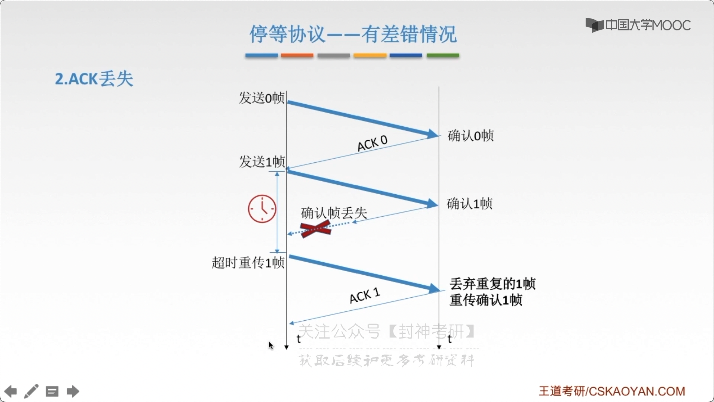

# chap3 - 数据链路层 - 流量控制与可靠传输机制

## 介绍

**较高的发送速度**和**较低的接受能力**不匹配，
会造成传输错误，因此流量控制也是 链路层的一项重要工作。

流量控制是必须的，因为可能会导致 接收方的 buffer 溢出

链路层的流量控制是 点对点的；而传输层的流量控制是 端到端 的

链路层流量控制手段：接收方收不下 就不回复确认

传输层流量控制手段：接收端给发送端一个窗口公告

几种控制方法：

- 停止-等待协议

  每发送完一个帧就停止发送，等待对方的确认，在收到确认后再发送下一个帧

  发送窗口大小=1，接受窗口大小=1

- 滑动窗口协议

  - 后退 N 帧协议（GBN）

    发送窗口大小>1，接受窗口大小=1

  - 选择重传协议（SR）

    发送窗口大小>1，接受窗口大小>1

滑动窗口，可以依次传递一批，然后进行一次确认

可靠传输：发送端发送啥，接收端就接收到啥

流量控制：控制发送速率，使接收方有足够的缓冲空间来接受每一个帧

滑动窗口解决：流量控制、可靠传输

    流量控制：只有在发送方接收到了 接收方的确认以后，才会继续发送（同步）

    可靠传输：发送方自动重传（超时）

## 停止-等待协议

在传输不是很稳定的年代，停止-等待协议是 链路层+传输层的。
但是随着科技发展，已经不需要在 链路层 有 停止-等待协议 了

### 为什么

除了 bit 出差错，底层信道还会出现丢包问题。

包？数据包！在链路层：帧；网络层：IP 数据包/分组；传输层：报文段

丢包：物理线路故障、设备故障、病毒攻击、路由信息错误等原因，会导致数据包的丢失

### 前提（假设）

现在都是全双工的通信方式，但是为了讨论问题方便，进考虑一方发送谁，一方接受数据。

停止-等待协议，使一个思想或者算法，并不考虑在哪一个层次

工作原理：每发送完一个分组就停止发送，等待对方确认，在收到确认后再发送下一个分组

### 无差错情况

帧的编号是可以复用的。

因为每发送完 一个数据帧 就停止并等待，因此只需要 0/1 交替就行了，也只是只用 1bit 编号就够了

三种错误情况：

1. 数据帧丢失 或 检测到帧出错

   超时重传（自动重传）

   

   1. 发完一个帧后，必须保留他的副本
   2. 数据帧 和 确认帧 必须编号

2. ack 的确认帧

   丢弃重复的 (1 帧)。重传确认 (1 帧)

   

3. ACK 迟到

   丢弃重复的 (0 帧)。重传确认 (0 帧)
   发送方 收到了 迟到的 ACK，收下就丢弃

   

   但是我觉得不对劲，如果出现了：刚发送完成了 数据帧 0，
   结果却收到了 上一轮迟到的 ACK0，那不就完蛋了

停止等待协议简单，确定是：信道利用率太低了

RTT：往返时延

信道利用率

## 后退 N 帧协议（GBN）

流水线技术

1. 一次发送一批发送窗口中的帧

2. 接收方发送 ackX 后，接受窗口移动

   不一定要一次一次发送 ack，可以只发送末尾的 ack 就行了

3. 发送方每收到一个 ackX，发送窗口移动

### GBN 必须响应的 三件事

1. 上层的调用

   上层要发送数据时，发送方先检查 发送窗口是否已经满了，如果未满，则产生一个帧并将其发送；
   如果 窗口已满，发送方只需将数据返回给上层，暗示上层：窗口已满。上层等一会再发送。
   （实际实现中，发送方可以缓存这些数据，窗口不满时再发送 帧）

2. 收到了一个 ack

   GBN 协议中，对 n 号帧的确认采用**累计确认**的方式，标明接收方已经收到 (n 号帧) 和 它之间的全部帧

   累计确认：当前帧，以及之前的所有帧 都已经 ack 了

3. 超时事件

   协议的名字为 《后退 N 帧》，来源于：出现丢失和时延过长帧时 发送方的行为。
   如果出现超时，发送方重传所有：已发送但是未被确认的帧

   

### GBN 接收方要做的事

如果正确收到 (n 号帧)，并且按序，那么接收方为 n 帧 发送一个 ack，
并将该帧的数据部分交付给长层。

其余情况都 丢弃帧，并为最近按序接受的帧重新发送 ack。接收方无需缓存任何 失序帧，
只需要维护一个信息：expectedSeqNum（下一个按序接受的帧序号）

### 窗口的长度？

窗口的长度肯定是不能无限的。

若采用 n 个 bit 对帧编号，那么发送窗口的尺寸 $W_T$ 要满足：$1 \le W_T \le 2^n - 1$。
因为发送窗口的尺寸过大，就会使得：接收方无法区分 新帧 与 旧帧

习题 1:

习题 2:

1. `1000 * 1000 * 8`表示：一次发送这么多的 bit，
   `8 * 10^6 / (100 * 10 ^ 6) = 80ms`，
   也就是一次发送完所有的数据要 80ms 这么长的时间

2. `2*50ms(往返时间) + (100 * 8)/(100 * 10^6) = 100.08ms`第一个帧传输周期是这么多

3. 比较：得到结论：往返时间就可以发送完 窗口中所有的数据了。
   知道了往返的周期，知道了一次可以发送的数据量，那么可以知道数据率：`数据量/往返周期`

缺点：如果有一个帧传错了，那么就要将所有的帧都重传

## 选择重传协议（SR，select remake）

能不能只重传 错误的帧呢？

接受窗口设置缓存

### SR 发送方必须响应的三件事

1. 上层调用

   从上层收到数据后，SR 发送方检查下一个可用于该帧的序号。如果序号位于发送窗口内，则发送数据帧；
   否则就像 GBN 一样，要么将数据缓存，要发返回给上层之后再传输

2. 收到了一个 ack

   如果收到 ack，加入该帧序号在窗口内，则 SR 发送方将那个被确认的帧标记为 已接收。
   如果该帧序号是 窗口的下界（最左边第一个窗口对应的序号），则窗口向前移动到具有最小序号的未确认帧出。
   如果窗口移动了，并且有序号在窗口内未发送帧，则发送这些帧

3. 超时事件

   每个帧都有自己的定时器，一个超时时间发生后只重传一个帧

### SR 接收方要做的事

来者不拒（窗口内的帧）

SR 接收方将：确认一个正确接收的帧 而不管其是否按序。失序的帧将被缓存，
并返回给发送方一个该帧的确认帧（收谁确认谁），直到所有帧（即序号更小的帧）皆被收到为止，
这时才可以将 一批帧按序交付给上层，然后向前移动滑动窗口。

如果收到了窗口序号外（小于窗口下界）的帧，就返回一个 ack。其他情况，就忽略该帧

### 运行中的 SR

### 窗口不能无限长

发送窗口 最好等于 接受窗口（大了会溢出，小了没意义）

### SR 协议重点 总结

1. 对数据帧注意确认，收一个确认一个

2. 只重传出错帧

3. 接收方有缓存

4. 窗口大小有限
