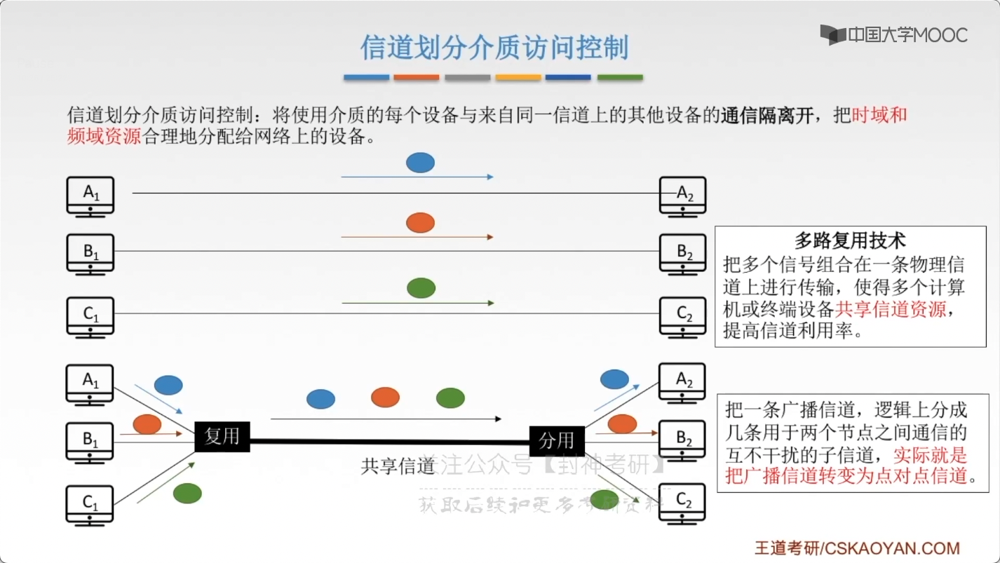
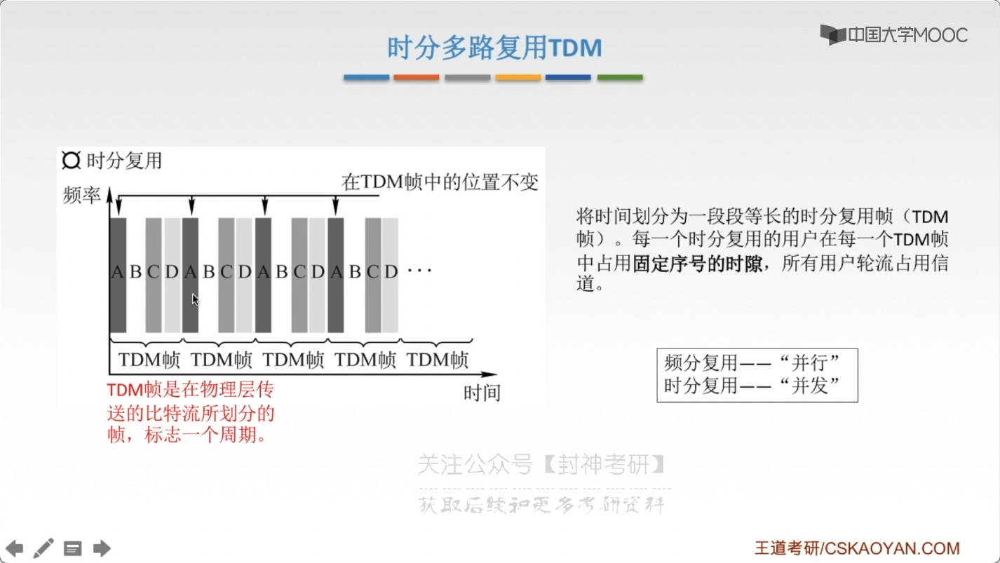
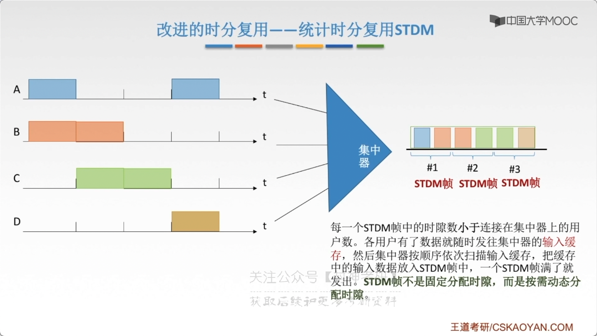
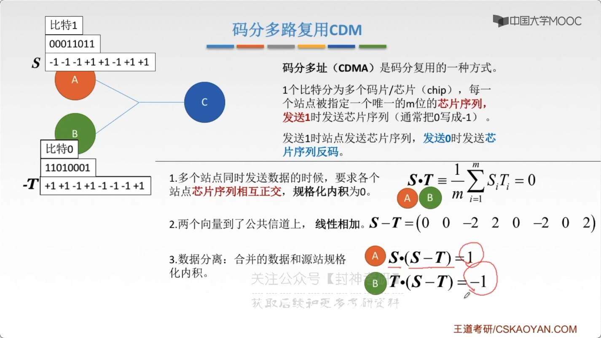
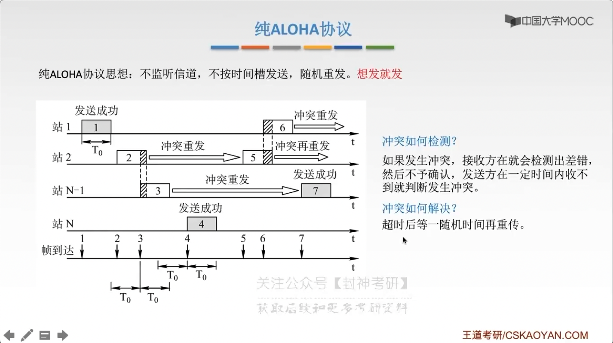
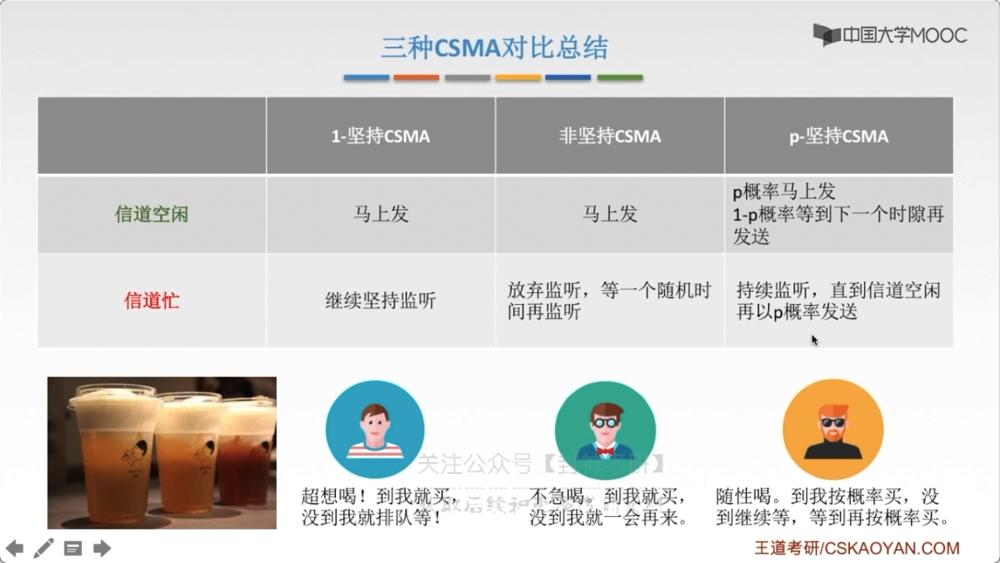
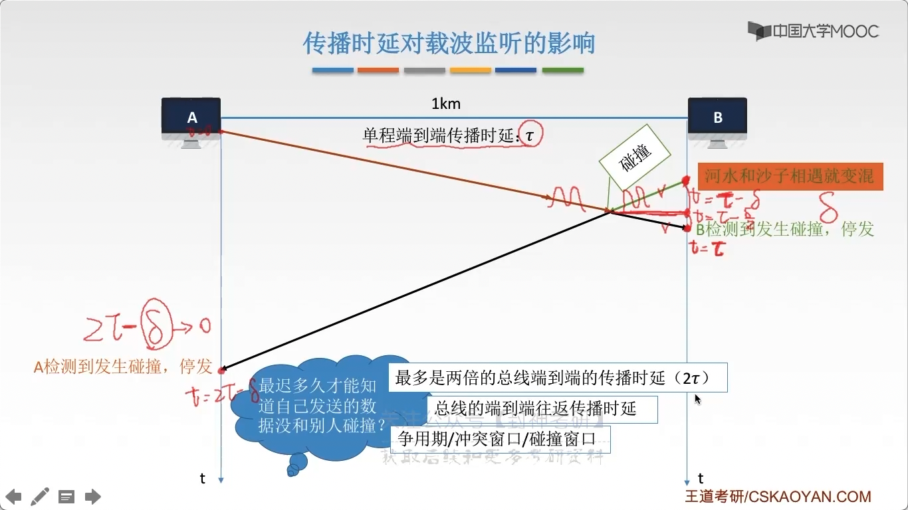
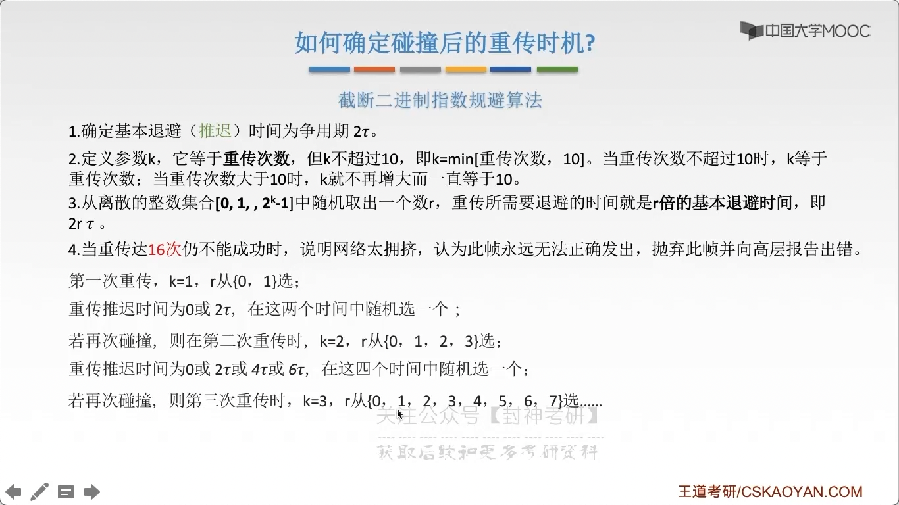
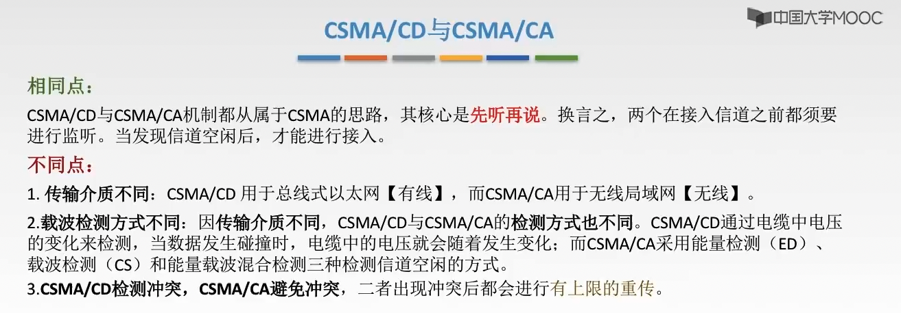

# chap3 - 链路层 - 两种链路

- 点对点链路

  两个相邻结点通过一个链路连接，没有第三者。
  应用：PPP 协议，常用于：广域网

- 广播式链路

  所有主机共享通信介质
  应用：早起的总线以太网、无线局域网。常用于：局域网
  典型拓扑结构：总线型、星型（逻辑总线型，因为中心是：集线器）
  总线型，一条链路断了，整个网络不行了。
  星型，可以有线路断了

  介质访问控制：对讲机同时说话可能会冲突

## 介质访问控制

介质访问控制：采取一定的措施，使得两对结点之间的通信不会发生相互干扰

1.  静态划分信道（信道划分介质 访问控制）

    1. 频分多路复用 (frequence division mux, FDM)
    2. 时分多路复用 (TDM, time)
    3. 波分多度复用 (WDM, wave)
    4. 码分多路复用 (CDM, code)

2.  动态划分信道

    1.  轮训访问介质 访问控制 --- 令牌传递协议

    2.  随机访问介质 访问控制 1. ALOHA 协议 2. CSMA 协议 3. CSMA/CD 协议 4. CSMA/CA 协议

        动态分配信道（动态媒体接入控制/多点接入）。
        特点：信道并非在用户通信时 固定分配给用户

## 信道划分介质 访问控制

将使用介质的每个设备 与来自同一信道上的其他设备 的 通信隔离开，
把时域 和 频域资源合理的分配给网络上的设备

### FDM

用户在分配到一定的频带后，在通信过程中自始至终都占用这个频段。
频分复用的所有用户 在 同样的时间占用不同的宽带（频率宽带）资源

充分利用 传输介质贷款，系统效率较高。由于技术标成熟，实现也比较容易

### TDM

将时间划分为 一段段等长的 时分复用帧（tdm frame），
每一个时分复用的用户在每一个 TDM 帧中占用固定序号的时隙，
所有用户轮流占用信道

### 统计时分复用 STDM(statistic time division mux)

每一个 STDM 帧中的时隙数小于 连接在集中器上的用户数。
每个用户有了数据就随时发往集中器的 输入缓存，然后集中器按顺序依次扫描输入缓存，
把缓存中的输入数据放入 STDM 帧中，一个 STDM 帧满了就发出。
STDM 帧不是固定分配时隙，而是按需动态分配时隙

### 波分多路复用 WDM

波分多路复用就是光的频分多路复用，在一根光纤中传输多种不同波长（频率）的光信号，
由于 波长（频率）不同，所以各路光信号互不干扰，最后再用波长分解复用器将各路波长分解出来

### 码分多路复用 CDM

码分多址 CDMA 是码分复用的一种方式。

每一个站点被指定一个唯一的 m 位的芯片序列（芯片序列就是 向量）。

多个站点同时发送数据时，要求各个站点芯片序列相互正交，规格化内积为 0

规格化就是：向量长度为 1

- 发送 1 时发送 芯片序列。
- 发送 0 时发送 芯片序列反码。

两个向量到了 公共信道上，线性相加

数据分离：合并的数据 和 src 规格化内积

## 随机访问介质 访问控制

所有用户可以随机发送信息，发送信息时占全部带宽
（不协调 ---> 协议处理冲突）

### ALOHA 协议

除了 ALOHA 协议，还有：时隙 ALOHA 协议

纯 ALOHA 协议思想：不监听信道，不按时间槽发送，随机重发。想发就发。

- 冲突如何检测？

  如果发生冲突，接收方就会检测出差错，
  然后不予确认，发送方在一定时间内收不到就会判断冲突

- 冲突如何解决?

  超时后等一随机事件再重传

如果一旦冲突，就会发生等待与重传，效率很低

#### 时隙 ALOHA 协议

时隙 ALOHA 协议的思想：把时间分成若干个相同的时间片，
所有用户在时间片开始 时刻同步接入网络信道。
若发生冲突，则必须等到下一个时间片开始时刻再发送。

控制想发就发的随意性

- (纯 aloha) 比 (时隙 aloha) 吞吐量更低，效率更低
- (纯 aloha) 想发就发，(时隙 aloha) 只有在时间片段开始时才能发

## CSMA 协议

载波监听多路访问协议(carrier sense multiple access)

简单来说就是，先听后发

CS: 载波监听，每一个站在发送数据之前要 检测一下 总线上是否有其他计算机在发送数据

如何检测呢？当几个站同时在总线上发送数据时，总线上的信号 电压摆动值 将会增大（相互叠加）。
当一个站 检测到的信号电压摆动值超过一定的 门限值时，就认为总线上至少有两个站同时在发送数据，
表明产生了碰撞，即发生了冲突

MA(multiple access): 多点接入，表明许多计算机以 多点接入的方式 连接在一根总线上

监听结果：

- 信道空闲：发送完整帧
  - 1-坚持 CSMA
  - p-坚持 CSMA
  - 非坚持 CSMA
- 信道忙：推迟发送

坚持指的是：对于监听信道忙之后的坚持

### 1-坚持 CSMA

如果一个主机要发送消息，那么他会先监听信道

空闲则直接传输，不必等待。

忙则一直监听，直到空闲马上传输

如果有冲突（一段时间未收到肯定的回复），则等待一个随机长的时间再监听，重复上述过程。（有点像 aloha）

优点：只要媒体空闲，站点就马上发送，避免了媒体利用率的损失（媒体指的就是 信道)

缺点：假如有两个或两个以上的站点有数据发送，冲突就不可避免

### 非坚持 CSMA

非坚持 值得是：对于监听信道忙之后就不继续监听

非坚持 CSMA 思想：如果一个主机要发送消息，那么他先监听信道

空闲则直接传输，不必等待。

忙则等待一个随机时间之后再监听

优点：采用随机的重发延迟时间可以 减少冲突发生的可能性。

如果是 1-坚持，那么陷入等待的主机就会在信道空闲后马上争抢信道 ---> 冲突

缺点：可能存在大家都在延迟等待过程中，使得媒体仍可能处于空闲状态，媒体使用率降低

### p-坚持 CSMA

p-坚持 指的是：对于监听信道 空闲的处理

p-坚持 CSMA 思想：

如果一个主机要发送消息，那么他会监听信道：

- 空闲则以 p 概率直接传输，不必等待；概率 1-p 等待到下一个时间槽再传输
  （注意，这里是 时间槽，也就是 p-坚持 就是 时隙的）

- 忙则等待监听直到 信道空闲 再以 p 概率发送

若冲突则等到下一个时间槽开始再监听并重复上述过程

优点：既能像非坚持算法那样减少冲突，又能像 1-坚持算法那样减少媒体空闲时间的这种方案

缺点：发生突出后，还是要把数据帧发送完，造成了浪费

## CSMA/CD 协议

载波监听多点接入/碰撞检测 CSMA/CD（carrier sense multiple access withc collision detection）

先听再说，边听边说

- CS: 每一个站在 发送数据之前 以及 发送数据时 都要检测一下总线上是否有其他计算机在发送数据（检测？电压摆动？）
- MA: 多点接入，表示许多计算机都以多点接入的方式 连接在一根总线上。总线型网络
- CD: 碰撞检测（冲突检测），“边发送边监听”，适配器变发送数据边检测信道上信号电压的变化情况，
  以便判断自己在发送数据时 其他站是否也再发送数据。(半双工网络，肯定啊，总线型广播)

但是有一个问题，为什么我这里都是在 空闲的时候发送信号的，为什么我还有可能会发生冲突呢？传播时延

### 传播时延对载波监听的影响

记住这个 $2\tau$

### 如何确定 碰撞后的重传时机？

以免出现了极端情况：持续撞车

引入算法：阶段二进制指数规避算法

1. 确定基本退避（推迟）时间为 争用期（也就是这里的$2\tau$）
2. 定义参数 k，他等于重传次数，但 k 不超过 10，即`k=min[重传次数, 10]`。
   当重传次数不超过 10 时，k 等于重传次数；当重传次数大于 10 时，k 就不在增大而一直等于 10
3. 从离散的整数集合`[0, 1, ... , 2^k - 1]`中随机取出一个数 r，重传所需要退避的时间就是 r 倍 的基本退避时间，即 $2 r \tau$
4. 当重传达到 16 次不能成功时，说明网络太拥挤，认为此帧永远无法正确发出，抛弃此帧并向高层报告出错

### 最小帧长问题

就是：如果帧很短，在检测到碰撞之前（也就是$2\tau$），帧就已经发送完了，都不用叫停了都，优点尴尬。

因为需要规定：最小帧长

帧的传输时延至少要两倍于 信号在总线中的传播时延。$帧长(bit) / 数据传输速率 \ge 2\tau$。

以太网规定：最短帧长为 64B，凡是长度小于 64B 的 都是由于冲突而异常终止的 无效帧。
如果数据达不到 64B，那么就会填充，才能放心的放到 链路层中发送

### CSMA/CA 协议

最后面这个 CA 表示：collision avoidance

载波监听多点接入/碰撞避免

为什么要有 CSMA/CA ？ 无线局域网

- 无法做到 360° 全面检测碰撞（而且也不会有什么 $2\tau$）
- 隐蔽站：当 A 或 C 都检测不到信号，认为 信道空闲时，同时先终端 B 发送数据帧，就会导致冲突

有礼貌的 CSMA/CA

发送数据前，先检测信道是否空闲。

空闲则发送 RTS(request to send)，RTS 包括发射端的地址、接收端的地址、下一份数据将持续发送的时间等信息；信道忙则等待

接收端收到 RTS 后，将响应 CTS(clear to send)，解决了隐蔽站问题

发送端收到 CTS 后，开始发送数据帧（同时预约信道：发送方告知其他站点自己要传多少数据）

接收端 收到数据帧后，将用 CRC 来检验数据是否正确，正确则响应 ACK 帧。

发送方收到 ack 就可以进行下一个 数据帧的发送，若没有则已知重传至规定 重发次数位置（采用 二进制指数退避算法 来确定随机的推迟时间）

机制：

1. 预约信道
2. ack 确认帧
3. RTS/CTS 帧 ---> （可选）解决隐蔽站，这其实建立了连接

## 轮训访问介质 访问控制

信道划分 介质访问控制（MAC, media access control）协议，当然也是 静态

- 基于多路复用技术划分资源：

  - 网络负载重：共享信道效率高，公平
  - 网络负载低：共享信道效率低，一堆结点处于空闲状态，但是时间片(或其他)还是会轮到

- 随机访问 MAC 协议（会产生冲突）

  用户根据意愿随机发送信息，发送信息时刻独占信道宽带。

  - 网络负载重： 产生冲突开销
  - 网络负载低： 共享信道效率高，单个结点可利用信道全部宽带

- 轮询访问 MAC 协议/轮流协议/轮转访问 MAC 协议

  既要不产生冲突，又要发送时占全部带宽

主节点 轮流 “邀请” 从属节点发送数据

- 优点：不会产生冲突
- 缺点：
  - 轮询开销
  - 等待延迟
  - 单点故障（主节点挂了）

## 令牌传递协议

令牌环网，逻辑上是环形的；但实际上是 星型的

令牌：一个特殊格式的 MAC 空指针，不包含任何信息。
控制信道的使用，确保同一时刻只有一个结点独占信道

每一个结点都可以在一定时间内（令牌持有时间）获得发送数据的权利，并不是无限制的持有令牌

- 问题：
  - 令牌开销（可能会出现 令牌空转的情况）
  - 等待延迟
  - 单点故障（环形破坏了）
