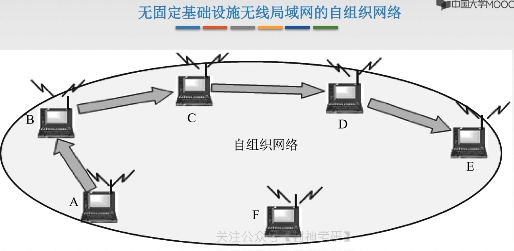

# chap3 - 数据链路层 - 局域网的基本概念

## 局域网

local area network

## 局域网拓扑结构

以太网就是：逻辑上的 总线拓扑

## 传输介质

## 访问控制方法

- CSMA/CD 常用于总线型局域网，也用于树形网络

- 令牌总线 常用于总线型局域网，也用于树形网络

  常用于 总线型或属性网络中的每一个工作站 按照一定顺序如按照接口地址大小 排列形成一个逻辑环。
  只有令牌持有者才能控制总线，才有发送信息的权利

- 令牌环 用于环形局域网，如令牌环网

## 局域网分类

1. 以太网

   以太网是 应用最为广泛的局域网，包括 标准以太网（10Mbps）、快速以太网（100Mbps）、千兆以太网（1000 Mbps）
   和 10G 以太网，TM 都符合 IEEE802.3 系列标准规范。逻辑拓扑总线型，物理拓扑是星型或者拓展星型。使用 CSMA/CD

2. 令牌环网

   物理上采用了 星型拓扑结构，逻辑上是环形拓扑结构。已经是 “明日黄花”

3. FDDI（fiber distributed data interface） 网

   光纤分布式数据接口。物理上采用了双环拓扑，逻辑上是环形拓扑结构

4. ATM（asynchronous transfer mode） 网

   较新型的单元交换技术，使用 53 字节固定长度的单元进行交换

5. 无线局域网(wireless local area network; wlan)

   采用 IEEE802.11 标准

## IEEE802 标准

IEEE 802 系列标准是 IEEE802 LAN/MAN 标准委员会指定的 局域网、城域网技术标准（1980 年 2 月成立）

## MAC 子层 和 LLC 子层

IEEE 802 标准所描述的局域网参考模型只对应 OSI 参考模型的 数据链路层与物理层，
他将 数据链路层 划分为：逻辑链路层 LLC 子层 和 介质访问控制 MAC 子层

LLC 负责：识别网络层协议，然后对 他们 进行封装。
LLC 报头 告诉数据链路层 一旦帧被接收到时，应当对数据包做何种处理。
为网络层提供服务：无确认无连接、面相连接、带确认无连接、高速传送

MAC 子层的主要功能包括：数据帧的封装/卸装，帧的寻址和识别，帧的接受与发送，链路的管理，
帧的差别控制等。MAC 子层的存在拼比了 不同物理链路种类的差异性

## 以太网

指的是 由

### 10BASE-T 以太网

10BASE-T 是 基带信号(base) 的双绞线(T) 以太网。现 10BASE-T 采用的是 无屏蔽双绞线(UTP)，
传输速率是 10Mb/s

物理上采用 星型拓扑，逻辑上总线型，每段双绞线最长为 100m

采用 曼彻斯特编码

采用 CSMA/CD 介质访问控制

### 适配器 和 MAC 地址

适配器：网络接口板、网络接口卡 NIC(network interface card)。
现在大多数 PC 使用的是 集成网卡。适配器上装有处理器和存储器(存储器既包括 RAM 也包括 ROM)
ROM 上有计算机硬件地址 MAC 地址。

在局域网中，硬件地址 又称为 物理地址，或者 MAC 地址【实际上是标识符】

MAC 地址：每个适配器有一个全球唯一的 48 位二进制地址，前 24 位代表厂家(由 IEEE 规定)，
后 24 位厂家自己制定。常用 6 个十六进制数来表示

### 以太网 MAC 帧

最常用的 MAC 帧 是以太网 V2 的格式

- 上面这个 1500 是：链路层的最大数据传输单元 MTU，
- 46：之前讲过最小帧长是 64B，然后这里：目标地址 6 + 原地址 2 + 类型 2 + FCS 4 = 18。64 - 18 = 46
- 类型指的是：采用了什么协议
- FCS：CRC 循环冗余检验 的 检验序列

### 高速以太网

1. 100BASE-T 以太网

   在双绞线上 传送 100Mb/s 基带信号的 星型拓扑以太网，仍使用 IEEE802.3 的 CSMA/CD 协议。

   支持全双工 和 半双工，可以在 全双工方式下工作 而无冲突。因为星型拓扑中间是：交换机。
   交换机的每一个端口都是一个冲突域，可以隔离冲突

2. G bit 以太网

3. 10G bit

   采用的介质是：光纤

## 无线局域网 IEEE802.11

### 802.11 MAC 帧头格式

AP：无线接入点，也叫做 基站。

到了城市，手机寻找基站。基站中注册手机号（数据库）

这里有几个地址：

- RA 接收端（基站 mac 地址）
- TA 发送端（基站 mac 地址）
- DA 目的地址（终端 mac 地址）
- SA 原地址（终端 mac 地址）

### 无线局域网分类

1. 有固定基础设施的 无线局域网

   漫游表示：跨基站 通信。

   漫游的话，需要一个：分配系统 DS

   基本服务集：也就是 AP，也就是基站，也就是 wifi 发送器

   两个基站，也就是两个 基本服务集连接起来，就是一个 拓展服务集

2. 无固定基础设施的 无线局域网的自组织网络

   

## VLAN

### 传统局域网的局限

传统局域网的局限：

- 缺乏流量隔离：即使把组流量局域划到一个单一交换机中，广播流量仍会跨越整个机构网络（ARP、RIP、DHCP 协议），会出现 洪范现象
- 管理用户不便：如果一个主机在不同组间移动，必须改变物理布线，连接到新的交换机上
- 路由器成本较高：局域网内使用很多路由器花销较大

### VLAN

虚拟局域网 VLAN（virtual local area network）是一种局域网内技术（将局域网内的设备划分成语物理位置无关的逻辑组），
这些逻辑组有某些共同的需求。每个 VLAN 是一个单独的广播域/不同的子网

### VLAN 实现

交换机上 生成的各 VLAN 互不相同，若想实现通信，需要借助：路由器、三层交换机

这里如何让 A、B 通信呢？ 交换机中存在一个 转发表，
可以针对 mac 地址，再通过转发表查询 mac 地址，然后将数据发往端口

交换机还有一个 VLAN 表。
那么在广播的时候，就会查询 VLAN 表，然后发送到 对应的端口中。
如果要发送到指定的 mac 地址，那么就先查询端口，再进行端口比对，如果在同一个 子网下，就发送。

当然，还有基于 mac 地址的 VLAN 表（这种有点写死了），
最后依然还是要查询 转发表 ---> 端口

#### “贴标签”

交换机与交换机之前连接 用一个 trunk 端口。

如果要：A ---> B，A 主机会先准备好一个帧，到了 `交换机1` 这一块，交换机就会给帧贴上标签 `tag = VLAN1`，
然后传递给 `交换机2`，就会找 根据 mac 地址/查 VLAN 找到对应的端口

贴标签，数据结构：IEEE802.1

将 以太网帧 多了 4 个字节，作为 VLAN 标记。VLAN 前 2 个字节表明是：`IEEE802.1 Q帧`，
然后空出 `4位`，后面 `12位`是 VLAN 标识符 VID，唯一表示了该以太网帧属于哪个 VLAN。
因此 VID 表示范围是`0~4095`，0 和 4096 会空出来，实际取值范围是 `1~4094`

IEEE802.1Q 帧 是交换机来处理的，而不是由用户主机来处理的（即：主机与交换机之前只交换普通的以太网帧）

