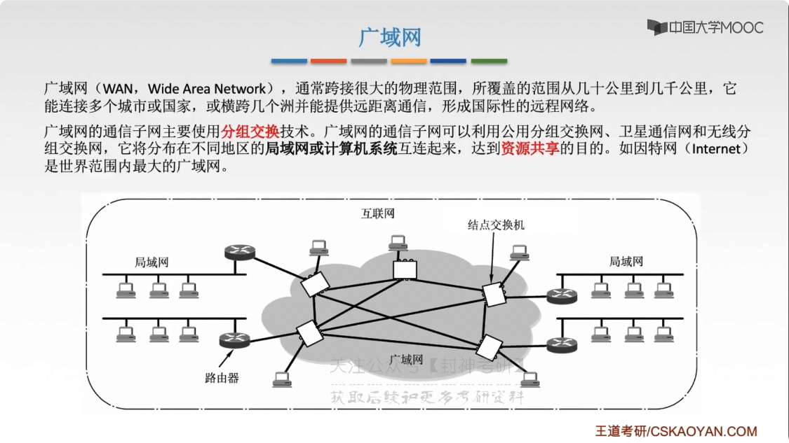
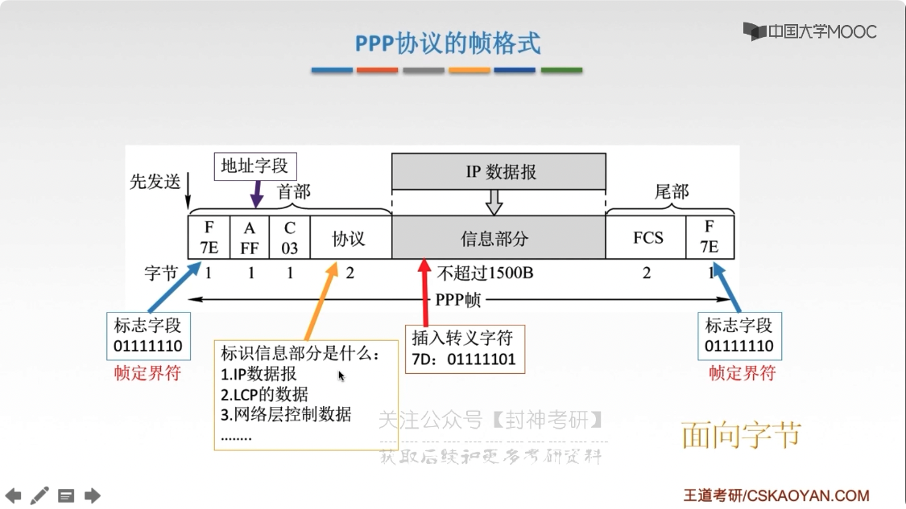
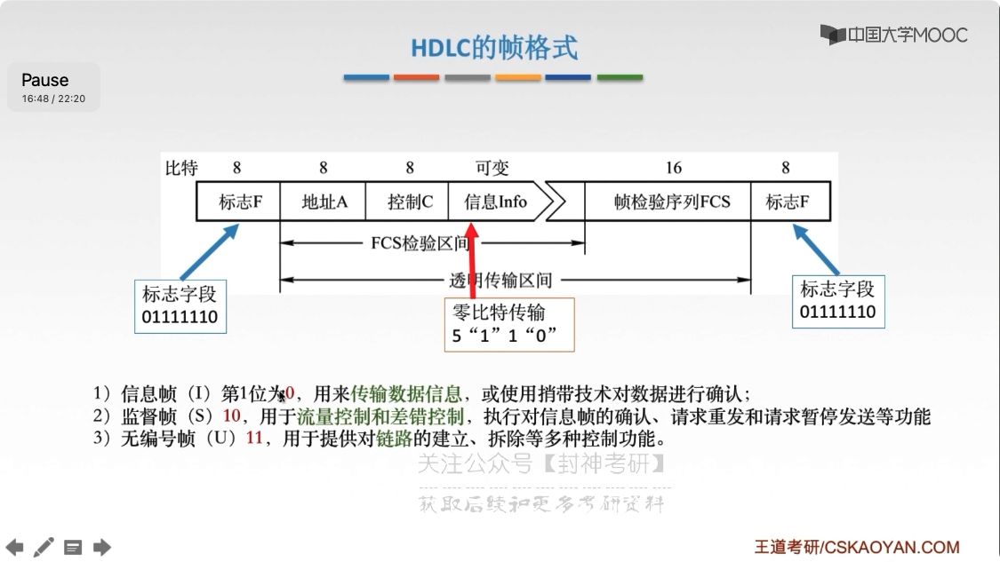
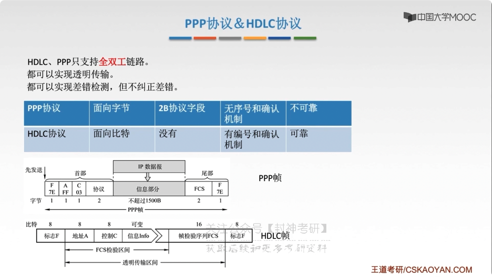

# chap3 - 数据链路层 - 广域网及相关协议

## 广域网

广域网（WAN, wide area network）

采用 分组交换 技术

- 局域网强调：数据传输
- 广域网只强调：数据共享

## PPP 协议的特点

点对点协议 PPP（point-to-point）是目前使用最广泛的链路层协议，用户使用拨号电话接入因特网时，一般都使用 PPP 协议。
**只支持全双工协议**

### PPP 协议应满足的要求

- 简单：对于链路层的帧，无需纠错，无需序号，无需流量控制
- 封装成帧：帧定界符
- 透明传输：与帧定界符一样 bit 组合的数据应该如何处理：异步线路用 字节 填充，同步线路用 bit 填充
- 多种网络层协议：封装的 `IP数据报` 可以采用多种协议
- 多种类型链路：串行/并行，同步/异步，电/光
- 差错检测：错就丢弃
- 检测连接状态：链路是否恒昌工作
- 最大传送单元：数据部分最大长度 MTU
- 网络层地址协商：知道通信双方的网络层地址
- 数据压缩协商

### PPP 协议的是哪个部分

1. 一个将 IP 数据报封装到 串行链路（同步串行/异步串行）的方法

2. 链路控制协议 LCP：建立病维护 数据链路连接（可以身份验证）

3. 网络控制协议 NCP：PPP 可支持多种网络层协议，
   每个不同的网络层协议都要一个相应的 NCP 来配置，为网络层协议建立 和 配置逻辑连接

### PPP 协议的帧格式

帧定界符：转义字符（面向字节）

- A：地址字段（原本是打算后面完善的，但是至今没有被完善）
- C：控制字段（同上）

FCS：帧循环检验序列（frame cycle sequence）

面向字节

## HDLC 协议

点对点协议。

高级数据链路控制（high level data link control），面向比特 的数据链路层

HDLC 协议是 不属于 TCP/IP 协议族的

可以实现 透明传输。“0 bit 插入法”（面向 bit）

### HDLC 站

- 主站

  主要功能是 发送命令（包含数据信息）帧、接受相应帧，并负责对整个链路的控制系统的 初启、流程的控制、差错检测、恢复

- 从站

  接受由主站发来的命令帧，向主站发送相应帧，并且配合主站参与 差错恢复等链路控制

- 复合站

  既能发送，又能接受命令帧和相应帧，并且负责整个链路的控制

三种数据操作方式：

- 正常响应方式
- 异步平衡方式
- 异步响应方式

### HDLC 帧格式

界定：`01111110`（0 + 1x6 + 0）。

- A，取决于响应的方式

  - 正常/异步响应：从站（地址）
  - 异步平衡方式：应答站（对方的地址）

- C
  - 信息帧（I）1，用来传输数据信息，或使用捎带技术对数据进行确认
  - 监督帧（S）0，用于流量控制和差错控制，执行对信息帧的确认、请求重发和请求暂停发送等功能
  - 无编号帧（U）11，用于提供对 链路的建立、拆除等多种控制功能

## HDLC、PPP

- PPP 可以：0bit 填充法，也可以 字节填充法（转义）
- HDLC 只能：0bit 填充法
- 都支持全双工
- 都可以实现透明传输
- 都可以差错检测，但不纠正差错

HDLC 不怎么用，因为没必要 可靠，打游戏接受不了延迟，纠正扔给 传输层。
