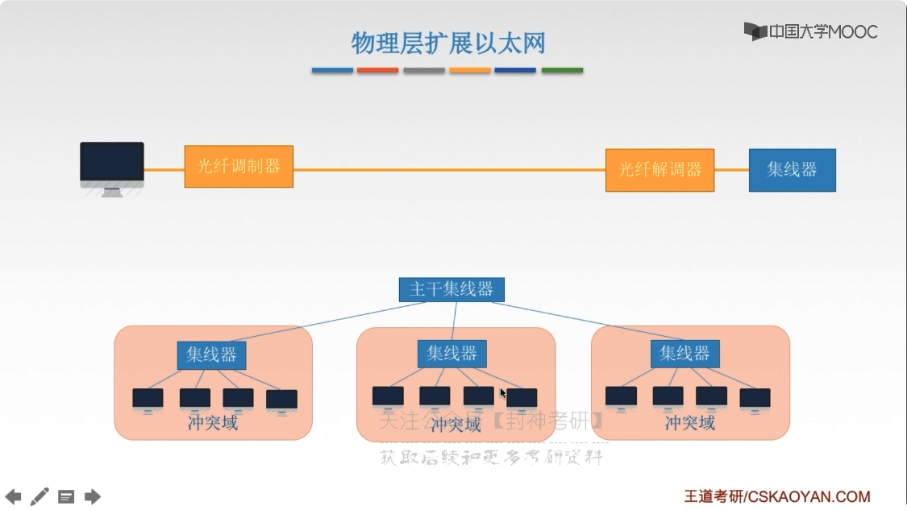
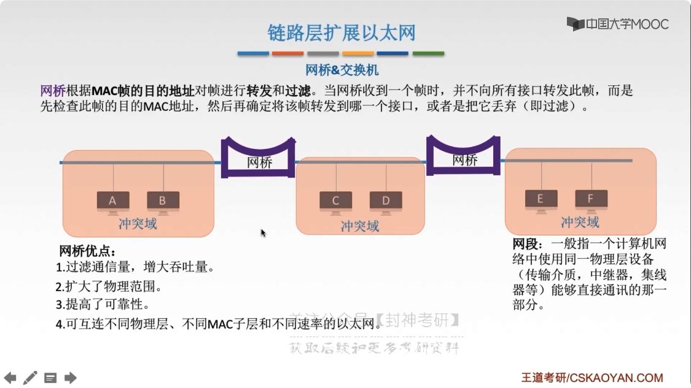
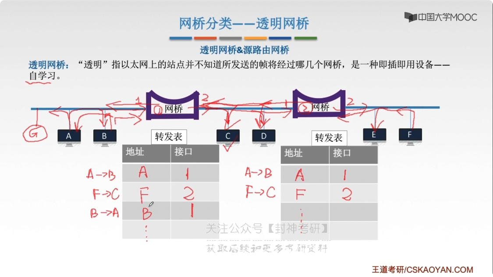
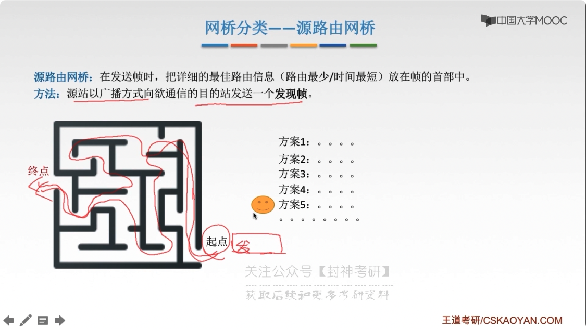
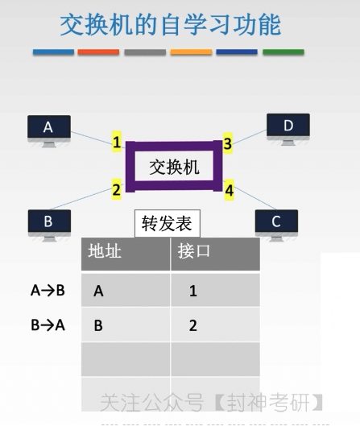
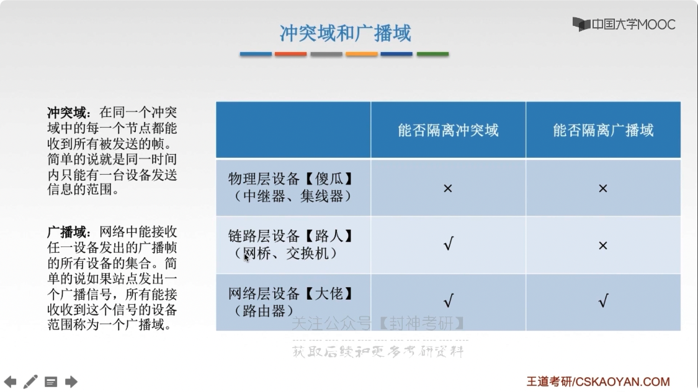
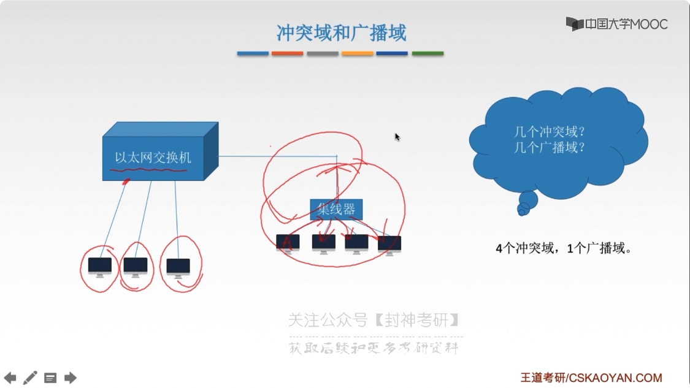

# chap3 - 链路层 - 链路层设备

## 物理层拓展以太网

双绞线不能超过 100m，减少失真。

两种解决方式：

- 光纤
- 共享冲突域

但是共享冲突域有问题，就是传输效率比较低

## 链路层拓展以太网

网桥（交换机的前身） & 交换机

网桥根据 MAC 帧的目的地址 对帧进行 转发 和 过滤。
当网桥收到一个帧时，并不向素有接口转发此帧，
而是先检查此帧的目的 MAC 地址，然后再确定该帧转发到哪一个接口，或者是把他丢弃（即过滤）

网段：一个网段就是一个冲突域。
网段：一般指一个计算机网络中使用同一物理层设备（传输介质，中继器，集线器等）
能够直接通讯的那一个部分。

网桥的优点：

- 过滤通信量，增大吞吐量
- 扩大了物理的范围
- 提高了可靠性（一般只会影响一个 网段）
- 互联不同物理层、不同 MAC 子层 和 不同速率的以太网

## 网桥分类

透明网桥、源路由网桥

### 透明网桥

“透明” 指的是：以太网上的站点 并不知道所发送的帧 将要讲过哪几个网桥，
是一种即插即用的设备 —— 自学习（插上就可以工作了，是用到了 自学习的算法）

网桥附带一个：转发表。自学习指的是：在通信的过程中，逐渐丰满转发表

网桥是不知道：网络的拓扑情况的。

如果在表中查到了，就不会继续冗余的传播。

转发表会在几分钟后更新一次，就是丢弃表中的内容，然后再自学习。

### 源路由网桥

源路由网桥：在发送帧时，把详细的最大路由信息（路由最小/时间最短）放到帧的首部中。

方法：源站以广播方式 向 欲通信的目的站发送一个 发现帧。
然后 发现帧后面会原路返回。如果有多条路径，那么就有优劣，然后就有最优方案。

## 以太网交换机的 两种交换方式

### 直通式交换机

查完目的地址（6B）就立刻转发。

延迟小，可靠性低，无法支持具有不同速率的端口的交换

### 存储转发式交换机（通常使用这种）

将帧放入高速缓存，并检查是否正确。正确则转发，错误则丢弃。

延迟大，可靠性高，可以支持具有不同速率的端口的交换

## 交换机的自学习功能

交换机也是可以自学习的

## 冲突域 和 广播域

冲突域：在同一个冲突域 中的每一个节点都能收到所有被发送的帧。
简单来说就是 同一个时间内 只能有一台设备发送信息的范围。

广播域：网络中能接受的 任一设备发出的广播帧的 所有设备的集合。
简单来说就是 如果站点发出一个广播信号，所有能接收到这个信号的设备范围成为一个 广播域

### 例题

