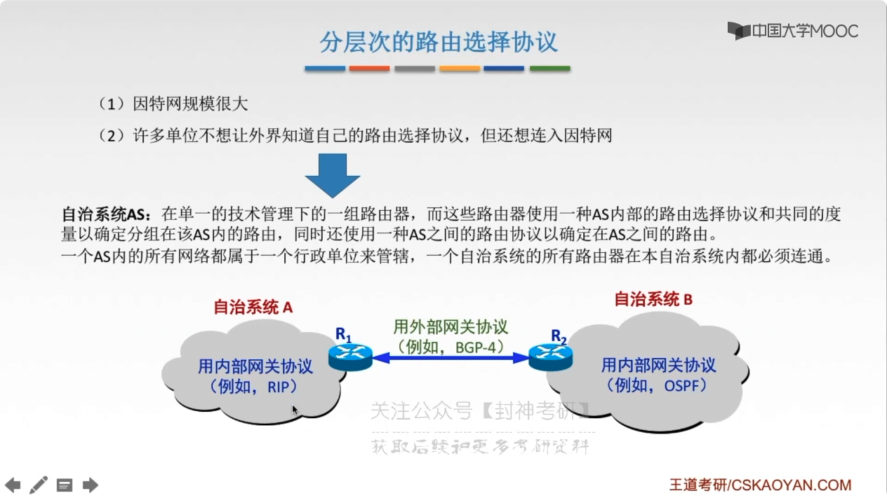

# chap4 - 网络层 - 路由算法及相关协议

## 路由算法

最佳路由： “最佳” 只能是 相对于某一种特点要求下 较为合理的选择而已。
（是通过算法得到的）

## 路由算法的分类

静态路由算法（非自适应路由算法）： 管理员手工配置路由信息

    简便、可靠，在负荷稳定、拓扑变化不大的网络中运行效果好，广泛用于高度安全性的军事网络 和 较小的商业网络

    缺点：路由更新慢，不适用于 大型网络

动态路由算法（自适应路由算法）： 路由器间彼此交换信息，按照路由算法优化出路由表项

    路由更新快，适合大型网络，及时响应链路费用 或 网络拓扑变化

    缺点：算法负责，增加网络负担

- 动态路由算法
  - 全局性：链路状态路由算法 OSPF：
    所有路由器掌握全部的网络拓扑和链路费用信息
  - 很伤心：距离向量路由算法 RIP：
    路由只掌握物理项链的邻居及链路费用

## 分层次路由选择协议

为什么？ 1) 因特网规模很大 2) 许多单位不想让外界知道自己的路由选择协议，但是还想要接入因特网

自治系统 AS：在单一的技术管理下的一组路由器，而这些路由器使用一种 AS 内部的路由选择协议 和 共同的度量
以确定分组在该 AS 内的路由，同时还使用一种 AS 之间的路由协议以确定在 AS 之间的路由

如果一个 AS 内的所有网络都属于一个行政单位来管辖，那么一个自治系统的所有路由器在本自治系统内都必须连通

- 路由选择协议：
  - 内部网关协议 IGP：一个 AS 内使用的 RIP、OSPF
  - 外部网关协议 EGP：AS 之间使用的 BGP

