# chap4 - 网络层 - IP 数据报格式

## TCP/IP 协议栈

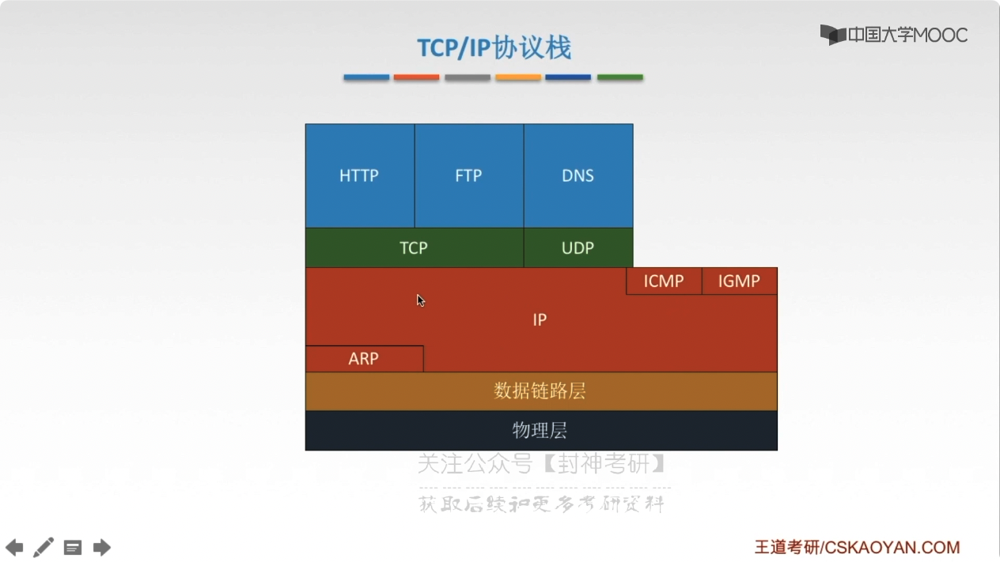

## IP 数据报格式

（先暂时把 分组 和 数据报 当成同一种东西）

IP：首部（固定部分+可变部分） + 数据部分（TCP、UDP 段）

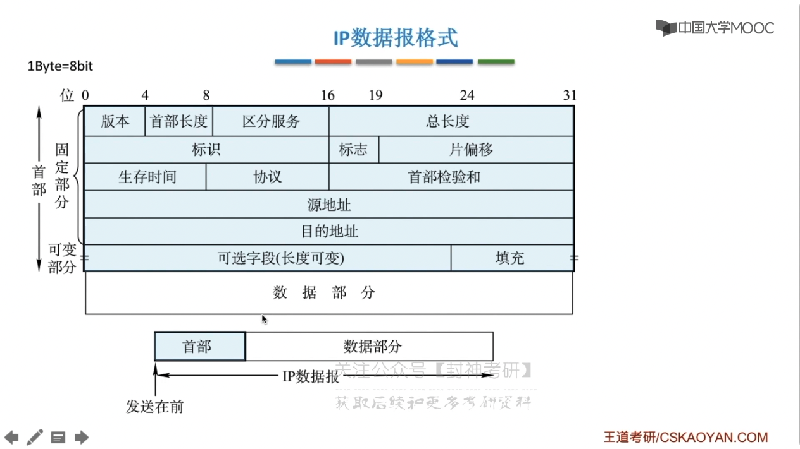

- 版本(有 4 位) ： IPv4 or IPv6 ？
- 首部长度(有 4 位)：(0~15) x 4B，但是我们固定部分是 20B，因此：(5~15) x 4B
- 区分服务(有 8 位)：指明 期望获得哪种类型的服务。如果不启用服务的话，可以空这
- 总长度(有 16 位)：整个数据报的长度，也就是 IP 数据报的长度为：(20~65535) x 1B。然而一般不会达到 65535，因为要满足 链路层的 MTU

- 标识（16bit）
- 标志（4bit）
- 片偏移（16bit）

- 生存时间（TTL, time to live）（8bit）：IP 分组的保质期。经过一个路由器 -1，变成 0 则丢弃。防止数据报死循环
- 协议（8bit）数据部分的协议
- 首部检验和（16bit）：只检验首部。看首部是否要出错

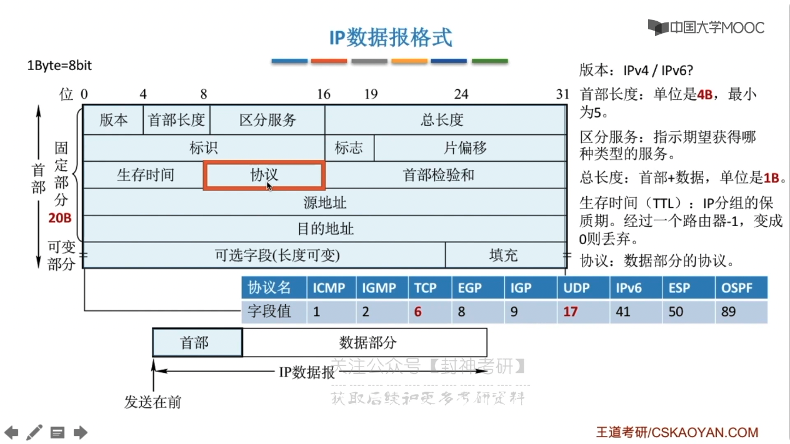

- src 地址（32bit）
- dest 地址（32bit）

- 可选字段（长度可变）+ 填充（要求首部是 4B 的整数倍，因为首部长度是 x4B 的）

## 最大传送单元 MTU

MTU：链路层数据帧可封装数据的上限。
以太网的 MTU 是 1500 B。

如果 `IP分组` 超过了 链路的 MTU ，怎么办？ 对 `IP分组` 分片。
如果 `IP分组` 就是不想让你分片呢？那么 `IP分组` 就不能继续向下传递了，
因此就会传输一个 SMP 的出错报文。

## IP 数据报分片

标识：同一数据报的分片使用 同一标识

- 标志（4bit）：只有 2 位有意义，也就是只有 2 位有用。

  - 第一位 DF（dont't fragment）
    - DF=1，禁止分片
    - DF=0，允许分片
  - 第二位 MF（more fragment）
    - MF=1，后面 “还有分片”
    - MF=0，代表最后一片/没分片了

- 片偏移：指出较长分组 分片后，某片在原分组中的相对位置。以 8B 为单位
  表示：除了最后一个分片，每个分片的长度一定是 8B 的整数倍

小结：IP 数据报格式：

- 总长度单位是 1B
- 片偏移单位是 8B
- 首部长度单位是 4B

### 例题

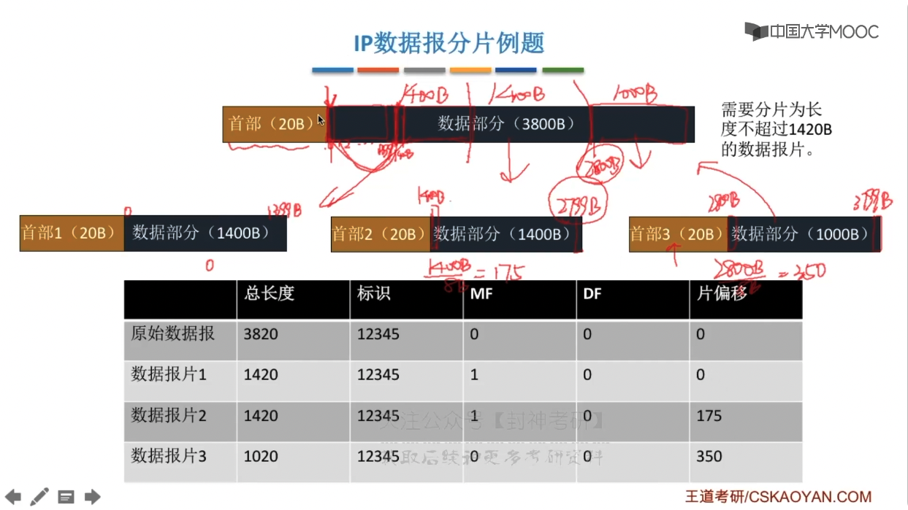

## IP 编织的历史阶段

分类的 IP 地址、子网的划分、构成超网（无分类编址方法）

## 分类的 IP 地址

比方说：123456_12345678_1234 这串身份证号

IP 地址：全世界唯一的 32bit/4B 标识符，标识路由器主机的接口（可以有 有线接口、无线接口）。
路由器，一个接口就是一个 IP 地址

`IP地址 ::= {<网络号> <主机号>}`

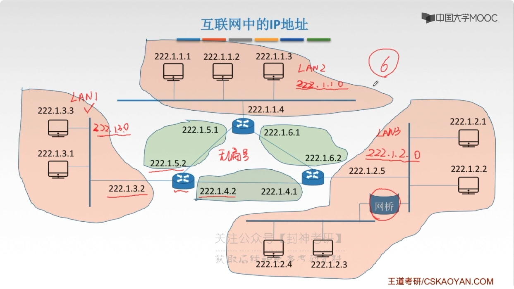

有一种网络叫做：无编号网络。上面这个网络，逻辑上有 6 个网络组成

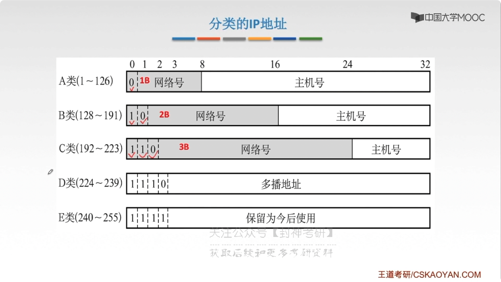

D 类地址是 多播地址，是在 一对多 通信的时候才会使用

## 特殊 IP 地址

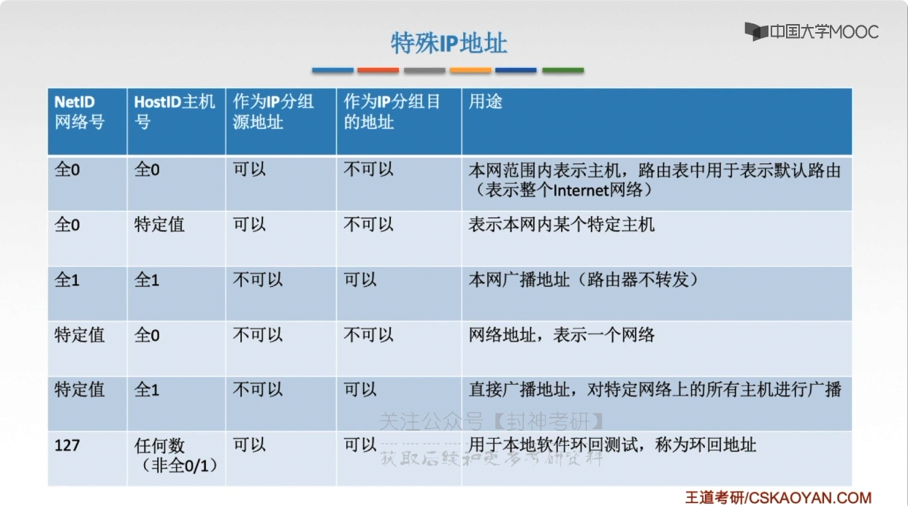

有点抽象

## 私有 IP 地址

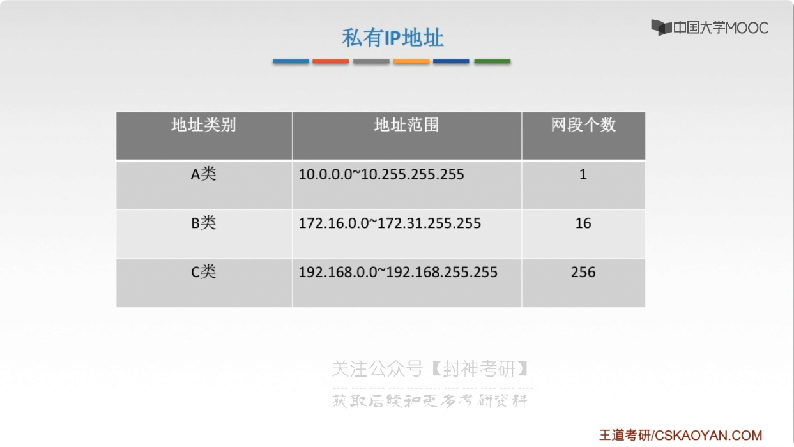

会涉及到 NAT 技术

## 分类的 IP 地址

- A 类：
  可用网络号：0000 不能用，127 不能用。剩下 7 个位，那么可以使用的网络号就是：`2^7 - 2`。
  可用主机号：全 0 不可用，全 1 也不可用（广播）
- B 类：
  可用网络号：`128.0`是不可用的，然后剩下有 14bit。那么可以额使用的网络号就是：`2^14 - 1`。
- C 类：（同理）

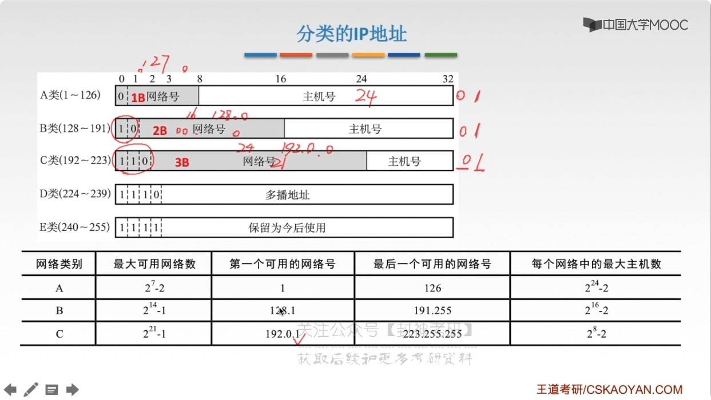

## 网络地址转换（NAT）

路由器对 目的地址 是 私有 IP 地址的 数据报一律不进行转发。

网络地址转换（network address translation）：在专用网连接到因特网的路由器上安装 NAT 软件，
安装了 NAT 软件的路由器叫 NAT 路由器，他至少有一个有效的外部全球 IP 地址。

端口号是一个：传输层的概念

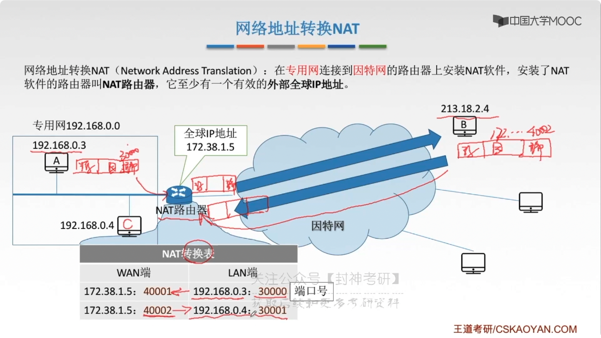

## 子网划分

分类的 IP 地址的弱点：

1. IP 地址的利用率有时很低
2. 两级 IP 地址不够灵活

- 两级 IP 地址：`{网络号, 主机号}`
- 三级 IP 地址：`{网络号, 子网号, 主机号}`

某单位划分子网后，对外仍表现为一个网络，即 本单位外的网络看不见本单位内子网的划分。至少留两位给主机号

## 子网掩码

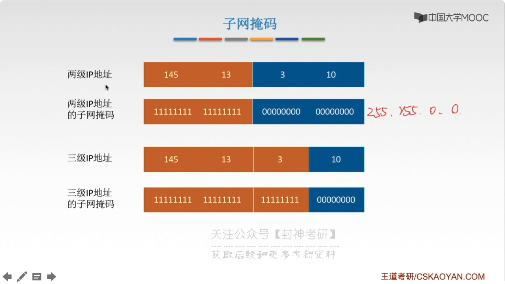

子网掩码 与 IP 地址相与，就得到了 子网网络地址

### 子网掩码例题

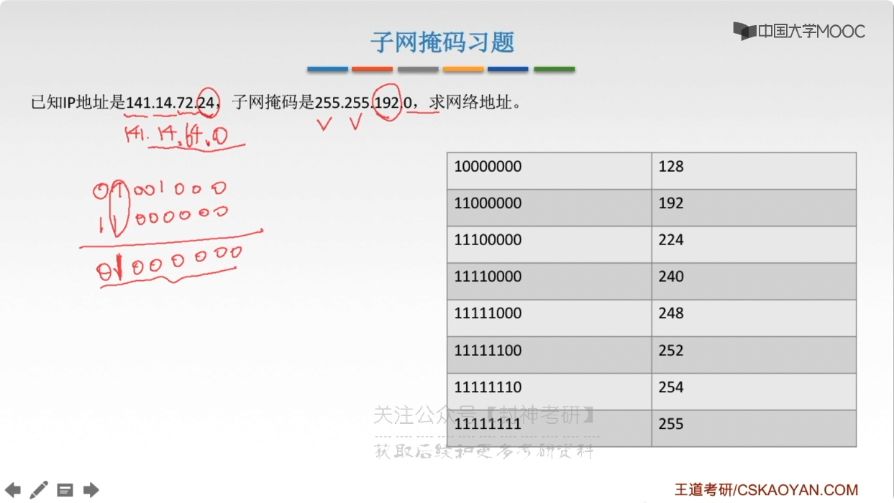

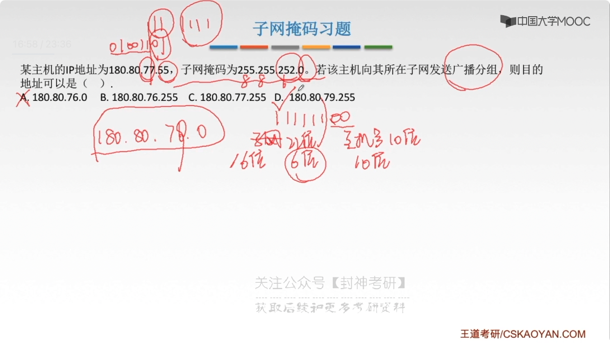

## 使用子网时 分组的转发

路由表中：

1. 目的网络地址
2. 目的网络子网掩码
3. 下一跳地址

路由器转发分组的算法：

1. 提取目的 IP 地址
2. 是否直接交付
3. 特定主机路由
4. 检测路由表中 有无路径
5. 默认路由 0.0.0.0 ---> 下一个路由器
6. 丢弃，报告转发分组出错（数据报有 TTL）

## 无分类编址 CIDR

背景：1992 年 B 类地址很快将分配网。路由表中的项目急剧增长

CIDR 采用了，`IP = {网络前缀, 主机号}` 的形式

沿用了：子网掩码的概念

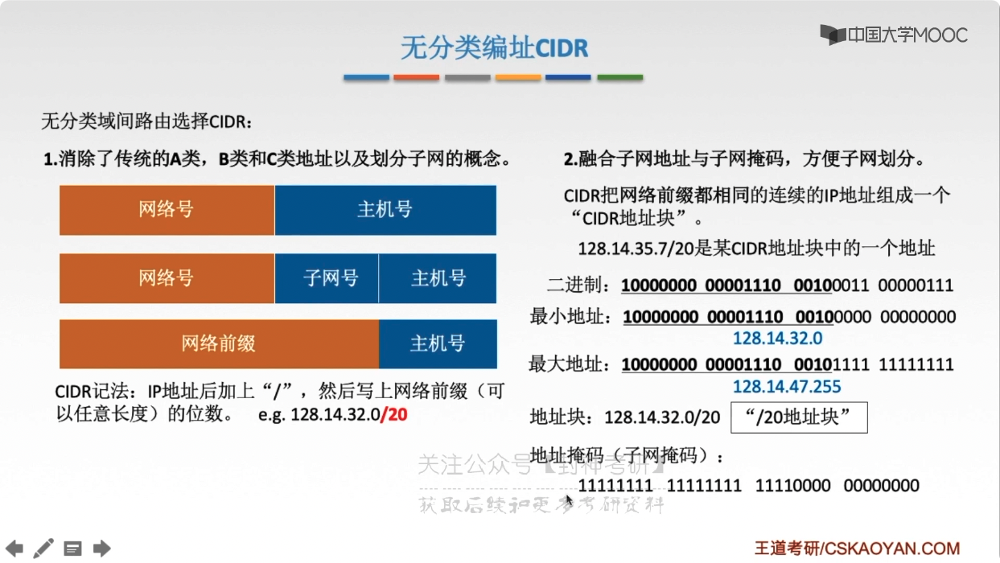

## 构成超网

将多个子网聚合成一个较大的子网，叫做构成超网，或者路由聚合

### 例题

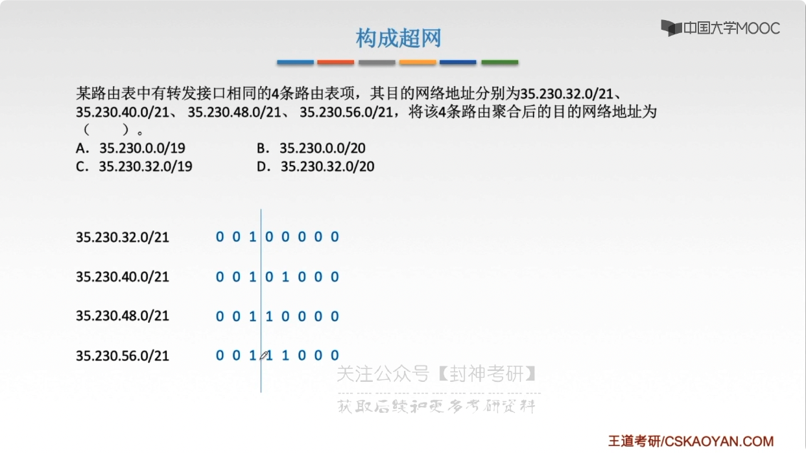

## 最长前缀匹配

使用 CIDR 时，查找路由表可能得到几个匹配结果（跟网络掩码按位相遇），
应选择具有最长网络前缀的路由。前缀越长，地址块越小，路由越具体

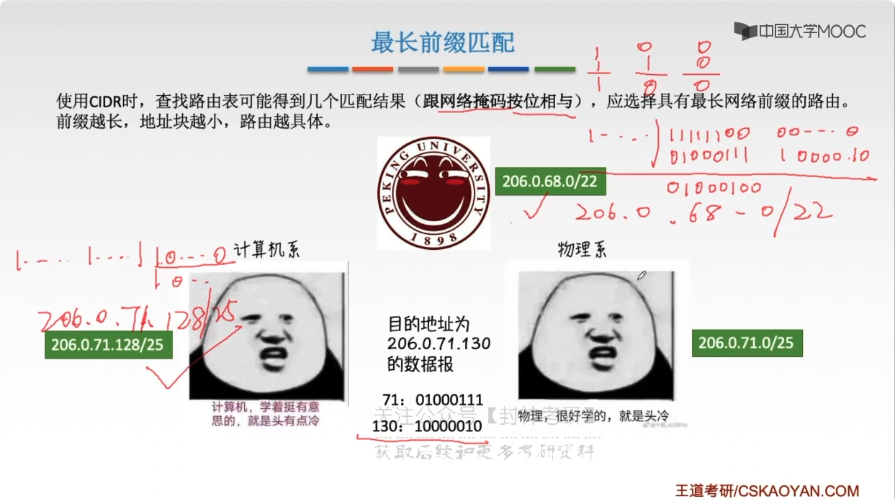

如何进行匹配：

1. 首先能匹配成功
   怎么看匹配成不成功：132.0.0.0/11 与 132.19.237.5 是能匹配成功的，因为 前 11 位都能匹配上
2. 还有一个是：如果能匹配，那么就会找前缀最长的

## ARP 协议

ARP 协议是介于：链路层 与 网络层之间的协议

### 发送数据的过程

#### 局域网内

应用层的 PDF，会在传输层分段，网络层加上 `IP报文`。
数据链路层会加上 mac 地址，src 和 dest。
src 的 mac 地址就是自己的 mac 地址，这很好知道，
问题是 dest 的 mac 地址。

每一个主机都会有一个：ARP 高速缓存，IP 地址与 MAC 地址的映射。

如果在 ARP 缓存中，找不到这个 dest 的 mac 地址。
那么就会：广播 `ARP请求分组`，会发送一个`{IP1, IP2, mac1, ff-ff-ff-ff-ff-ff}`的 “广播 ARP 请求分组”，
交换机：会把 `请求分组` 广播到每个端口上，只有 IP3 的主机才会响应这个 “请求分组”。
这个响应分组 称之为 “单播 ARP 响应分组”，这个时候，交换机只会给 mac1 对应的端口发送 分组。
这个分组 = `{IP, MAC3}`。

这个时候，`主机1` 就会在链路层，把分组填写好：`{FCS, 1, IP1, IP3, MAC1, MAC3}`，
最后放到物理层上传输

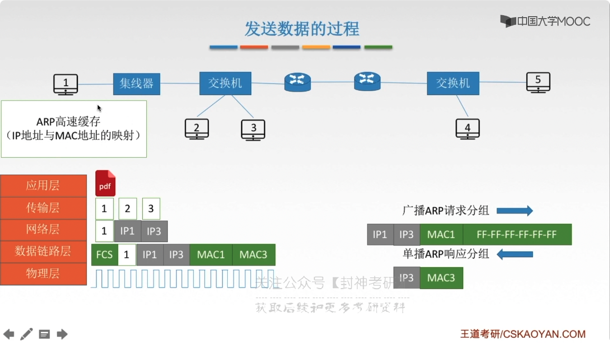

#### 局域网外

如果不再一个局域网内。那么在数据链路层：IP1 与 IP5 相与，发现不在一个局域网内。
那么 下一跳，就会跳到默认网关的 MAC 地址。

`ARP请求分组` + `ARP响应分组`

（交换机是没有 MAC 地址的）

到路由器了之后，路由器会解封装 + 再封装。
src 和 dest 的 IP 地址暂时不会发生变化（如果没有 NAT 的情况）。

ARP 协议：由于在实际网络的链路上传送数据帧时，最终必须使用 MAC 地址。

ARP 协议：完全主机或路由器 IP 地址 到 MAC 地址的映射

ARP 协议使用过程：检查 ARP 高速缓存，有对应表项则写入 MAC 帧，
没有则用 目的 MAC 地址 为 ff-ff-ff-ff-ff-ff 的帧封装 并广播 ARP 请求分组，
同一局域网中，所有主句都能收到该请求。dest 主机收到请求后就会向 src 主机单播一个 ARP 响应分组，
src 主机收到后将此映射写入 ARP 缓存（10~20min 更新一次）

ARP 协议的 4 种典型情况：

1. 主机 A 发送给本网络上的主机 B：用 ARP 找到主机 B 的 mac 地址
2. 主机 A 发送给另一个网络上的主机 B：用 ARP 找到本网络上一个路由器（网关）的 mac 地址
3. 路由器发给本网络的主机 A：用 ARP 找到主机 A 的 mac 地址
4. 路由器发给另一个网络的主机 B：用 ARP 找到本网络上的 一个路由器的 mac 地址

![](image/2024-02-25-16-45-30.png

## DHCP

主机的 IP 地址：固定的 IP 地址（静态配置）、动态配置

- 静态配置：
  - IP 地址
  - 子网掩码
  - 默认网关

DHCP 服务器 给主机动态的分配 IP 地址。

动态主机配置协议（dynamic host config protocal, DHCP）是应用层的协议，使用 客户/服务器方式，
客户端和服务端通过广播方式进行交互，基于 UDP，为网络层的通信提供基础。

DHCP 提供：即插即用联网的机制，主机可以从服务器动态获取 IP 地址、子网掩码、默认网关、DNS 服务器名称、IP 地址，
允许**地址重用**（IP 地址池），支持**移动用户加入网络**，支持**在用地址续租**

1. 主机广播 HDCP 发现报文 —— 主机大喊一句 “有没有 DHCP 服务器呀”
2. DHCP 服务器广播 DHCP 提供报文 —— DHCP 大喊一句 “有有有”
3. 主机广播 DHCP 请求报文 —— 主机大喊一句 “那我用你给我的 IP 地址咯？”（广播，因为此时 主机还没有设置 默认网关）
4. DHCP 服务器广播 DHCP 确认报文 —— DHCP 大喊一句 “用吧” （广播，因为 主机还没有被设置 IP 地址）

这是采用 UDP 协议的，而不是 TCP

## ICMP 协议

ICMP 和 IGMP 协议是 介于：传输层 和 网络层 之间的协议。
为了更加有效的转发 IP 数据报 和 提高交付成功的机会

ICMP 报文，装在：IP 数据报的 数据部分

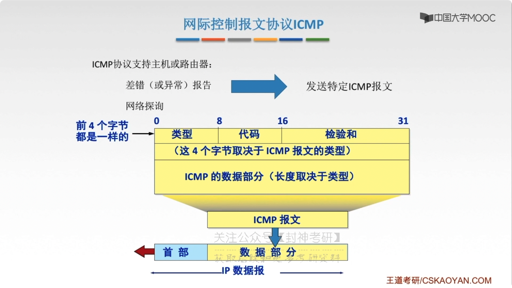

ICMP 协议支持 主机或路由器：

差错（或异常）报告 ---> 传送特定 ICMP 报文

- 类型（4 + 4bit，前 4bit 一样的）
- 代码（8bit）
- 检验和（16bit）
- （这 4 个字节取决于 ICMP 报文的类型）
- （ICMP 的数据部分，长度取决于类型）

### ICMP 差错报告 报文（5 种）

1. 终点不可达

   当路由器或主机不能交付数据报时，就像源点发送 终点不可达报告

   （无法交付）

2. 源点抑制

   当路由器或主机由于拥塞而丢弃数据报时，就向 src 发送 src 抑制报文，使 src 知道 应当把 数据报的发送频率放慢

   （拥塞丢数据）

3. 时间超过

   当路由器收到生存时间 TTL=0 的数据报时，除丢弃该数据报外，还要向源点发送时间超过报文。
   当终点在预先规定的时间内不能收到一个数据报的全部数据报时，就把已收到的数据报片都丢弃，并向源点发送时间超过报文

   （TTL=0）

4. 参数问题

   当路由器或目的主机收到的数据报的首部中 有的字段不正确时，就会丢弃该数据报，
   并向 src 发送参数问题报文

   （首部字段有问题）

5. 改变路由（重定向）

   路由器把改变路由报文发送给主机，让主机知道下次应将数据报发送给另外的路由器

   （可通过更好的路由）

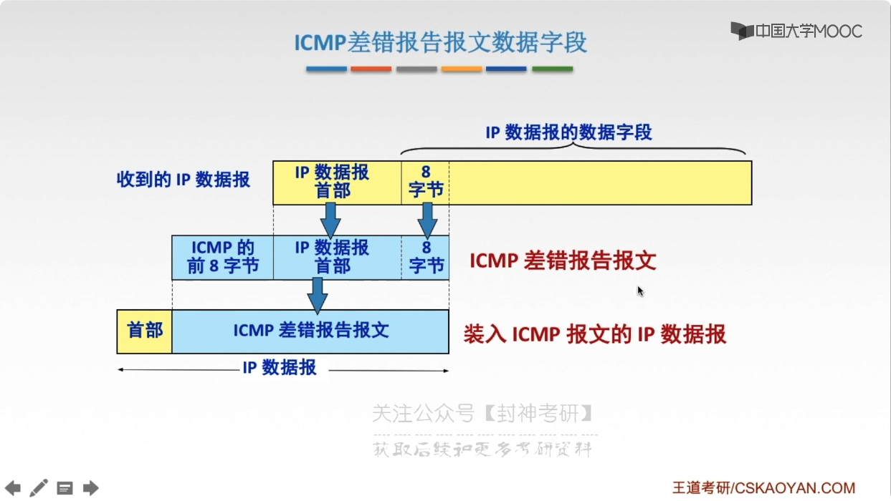

### 不应该发送 ICMP 差错报文的情况

1. 对 ICMP 差错报告报文，不在发送 ICMP 差错报告报文

   ICMP 报文是有可能出现问题的。
   这里的意思就是：不会对 ICMP 再发生的错误而再发送一次 ICMP 差错报文

2. 对第一个分片的数据报的所有后续数据报文都不发送 ICMP 差错报告报文

3. 对具有**组播地址**的数据报，都不发送 ICMP 差错报告报文

   组播是：1 对多；广播是：1 对所有

4. 对具有特殊地址（如 127.0.0.0 或 0.0.0.0）的数据报不发送 ICMP 差错报告报文

### ICMP 询问报文

1. 回送请求 和 回答请求

   主机或路由器向 特定目的主机发送的询问，收到此报文的主机必须给 src 或者路由器发送 ICMP 回送回答报文

   ping

   测试目的站是否可达，以及了解其相关状态

2. 时间戳请求和回答报文

   请某个主机或路由器回答当前的日期和时间。
   用来进行始终同步和测量时间

### ICMP 的应用

1. ping

   测试两个主机之间的连通性，使用 ICMP 回送请求 和 回答报文

2. trace route

   跟踪一个分组从源点到终点的路径，
   使用了 ICMP 时间超过 差错报告报文

   方法：数据报设置不同的 TTL

   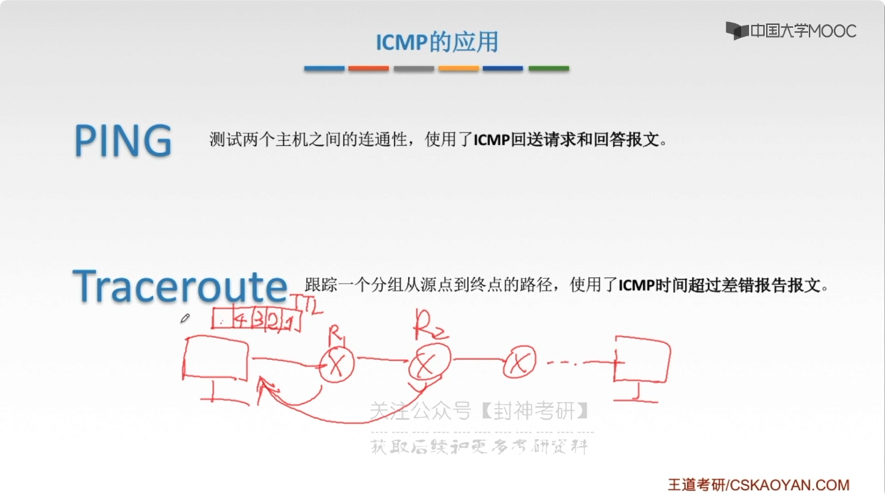
