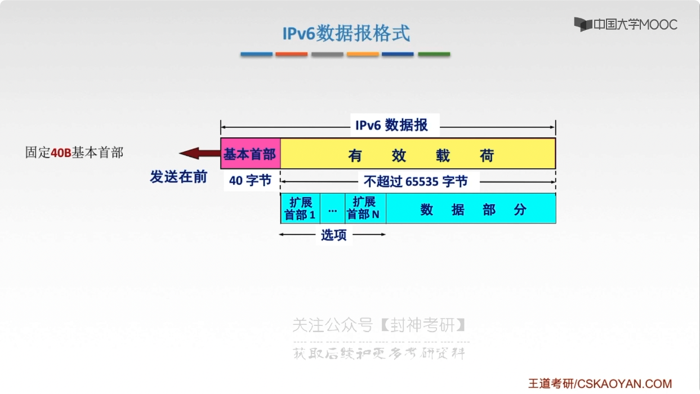
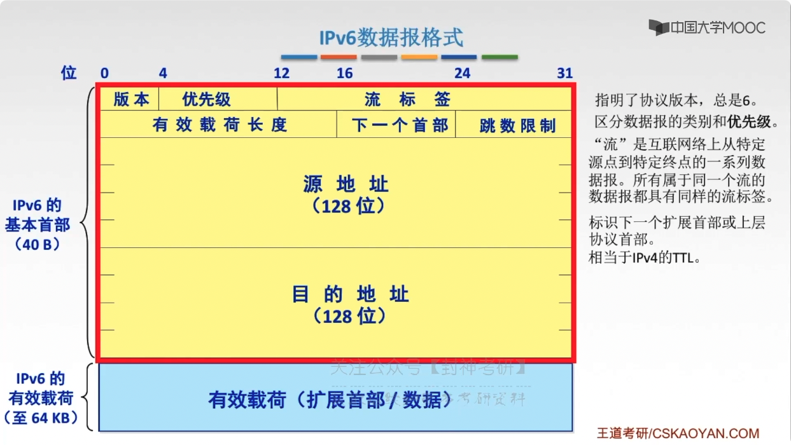
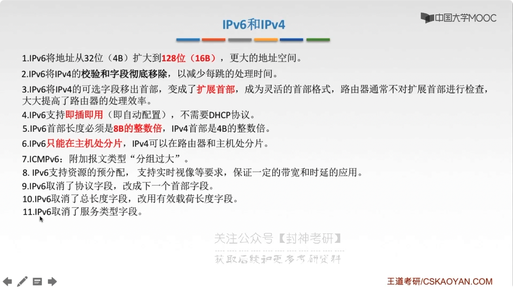
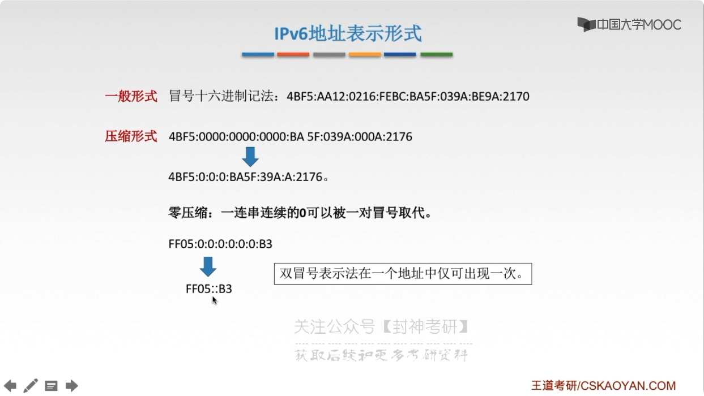
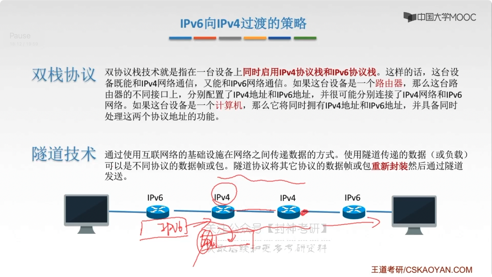

# chap4 - 网络层 - ipv6

## 为什么会有 IPv6？

改进首部格式

支持 QoS（quality of service, 服务质量）
指一个网络能够利用各种基础技术，
为制定的网络通信提供更好的服务技术，
是网络的一种安全机制，
是用来解决网络延迟和阻塞问题的一种技术

## ipv6 数据报格式

- 基本首部：固定 40B
- 有效载荷 = `{扩展首部1, ... , 扩展首部N, 数据部分}`

- 版本：指明了协议的版本

- 优先级：区分数据报的类型 和 优先级

- 流标签：

  “流” 是互联网上从 特定 src 到 特定 dest 的一些列数据报。
  所有属于同一个流的数据报都具有同样的流标签

- 有效载荷长度

- 下一个首部：基本首部/拓展首部，都一个一个字段：扩展首部字段，类似于链表了。
  基本首部的下一个首部，指的是：`拓展首部1`

## ipv4 vs ipv6

## ipv6 地址表示形式

不能使用 点分十进制，太长了

## ipv6 基本地址类型

- 单播：一对一通信：可做 src + dest
- 多播：一对多通信：可做 dest（ipv6 没有广播，因为广播可以用 多播实现）
- 任播：一对多中的一个通信，只可以做任播地址

## 向下兼容

双栈协议（来者不拒）：双协议栈技术 就是指：在一台设备商 **同时启用 ipv4 协议栈和 ipv6 协议栈**。
这样的话，这台设备既能和 ipv4 网络通信，又能和 ipv6 网络通信。如果这台设备是一个**路由器**，
那么这台路由器的不同接口上，分别配置了 ipv4 地址和 ipv6 地址，并很可能分别连接了 ipv4 网络和 ipv6 网络。
如果这台设备是一个计算机，那么它将同时拥有 ipv4 地址和 ipv6 地址，并具备同时处理这两种协议地址的功能

隧道技术：通过使用互联网络的基础设施在 网络之间传递数据的方式。使用隧道传递的数据（或负载）
可以是不同协议的数据帧或包。隧道协议将其他协议的数据帧或**包重新封装**，然后通过隧道发送。

